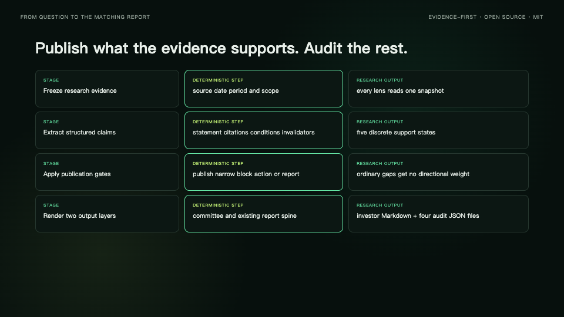
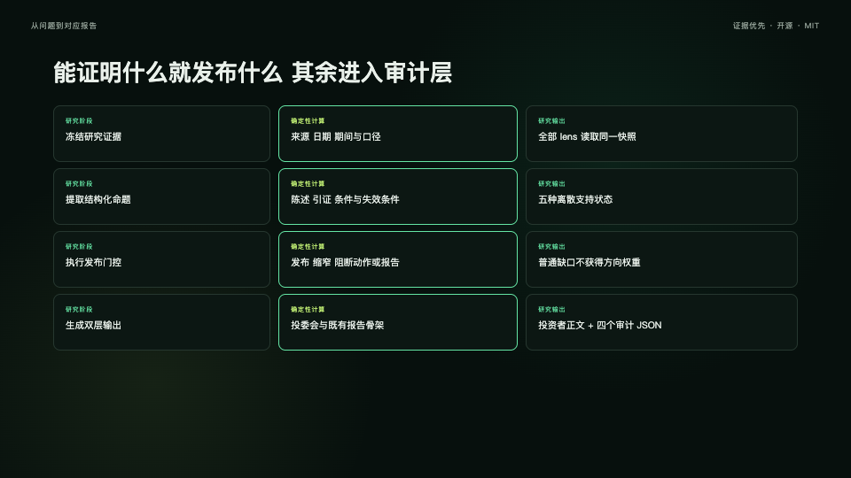
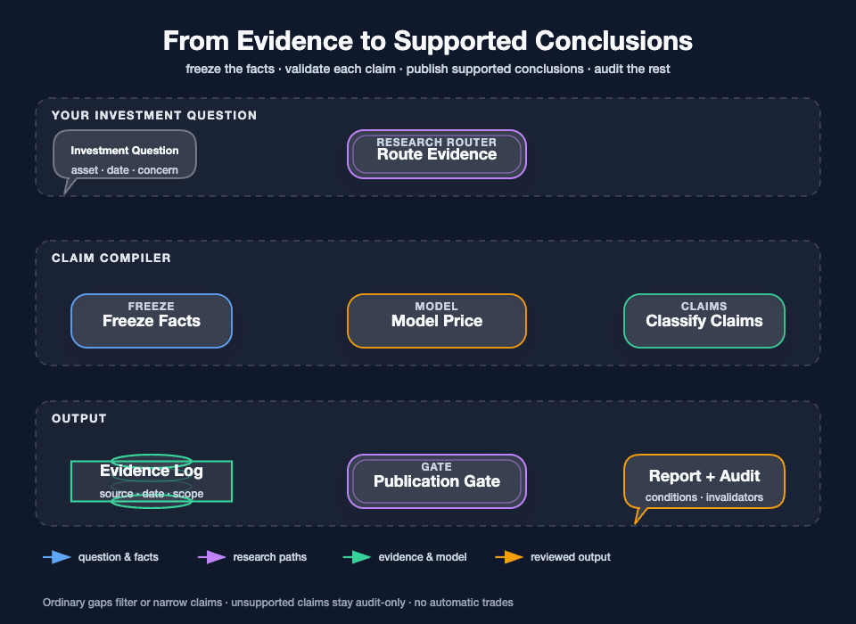
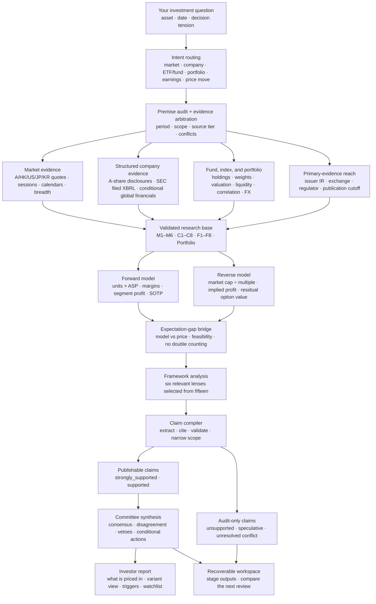
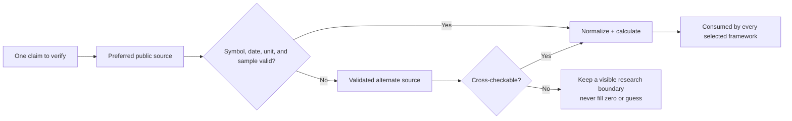
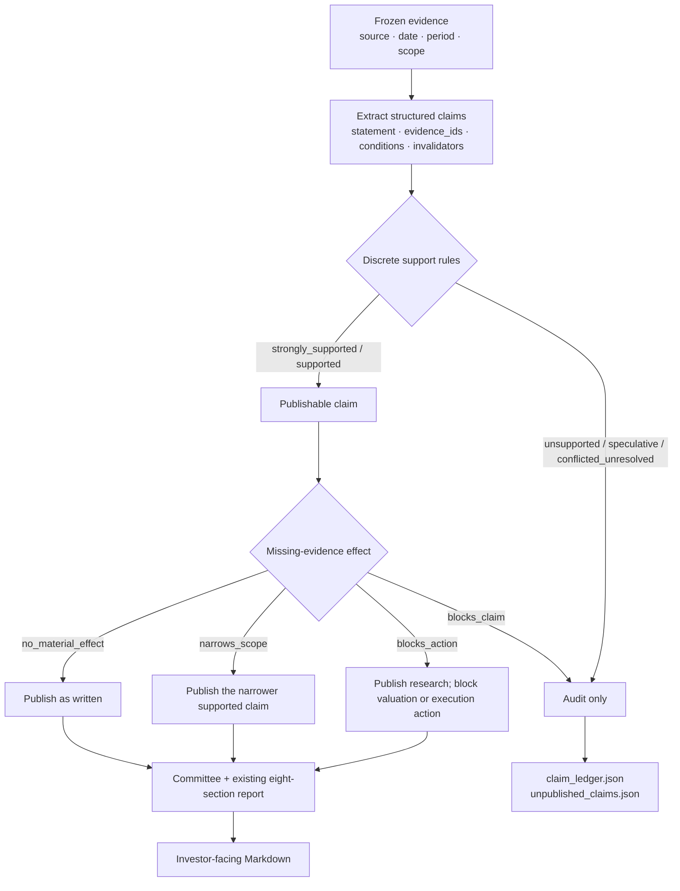

# stock-analysis

<div align="center">
  <a href="./README.md">English</a> |
  <a href="./README.zh-CN.md">简体中文</a>
</div>

<p align="center">
  <a href="https://github.com/AdvancingTitans/stock-analysis/releases/tag/v4.16.0"></a>
  <a href="https://pypi.org/project/stock-analysis/"></a>
  <a href="https://github.com/AdvancingTitans/stock-analysis/actions/workflows/ci.yml"></a>
  <a href="https://www.python.org/"></a>
  <a href="LICENSE"></a>
</p>

<p align="center">
  
</p>

<p align="center">
  <strong>Evidence-first investment research for agents and humans.</strong>
</p>

<p align="center">
  Verify the premise · Model the business · Reverse the price · Publish only supported claims
</p>

<p align="center">
  <a href="https://github.com/thuquant/awesome-quant"></a>
  <a href="https://github.com/leoncuhk/awesome-quant-ai"></a>
  <a href="https://github.com/wangzhe3224/awesome-systematic-trading"></a>
  <a href="https://github.com/0xNyk/awesome-hermes-agent"></a>
</p>

<p align="center">
  A/HK/US/JP/KR stocks · ETFs and funds · Portfolios · Primary disclosures · Forward/reverse valuation · Dynamic committee
</p>

<p align="center">
  Recognition: <a href="https://github.com/thuquant/awesome-quant/pull/48">awesome-quant #48</a> ·
  <a href="https://github.com/leoncuhk/awesome-quant-ai/pull/39">awesome-quant-ai #39</a> ·
  <a href="https://github.com/wangzhe3224/awesome-systematic-trading/pull/124">awesome-systematic-trading #124</a> ·
  <a href="https://github.com/0xNyk/awesome-hermes-agent/pull/232">awesome-hermes-agent #232</a>
</p>

Investors rarely struggle because they cannot generate another paragraph of commentary. The harder questions are more concrete:

- Is a falling quality company becoming attractive, or is the business changing?
- After a semiconductor ETF rallies sharply, are you buying an industry cycle or an overcrowded valuation?
- Did the latest filing improve earnings quality, cash conversion, and shareholder returns?
- Does a ten-position portfolio actually contain ten independent risks?

`stock-analysis` is an open-source, deterministic research operating system for global stocks, funds, and portfolios. It handles the hard middle of investment research: verify the premise, reconcile conflicting evidence, build the operating case, reverse the current market cap into the earnings it already discounts, and publish only claims that pass explicit evidence rules. The output shows the gap between your model and the market's model—not a one-line Buy/Sell label.

### Choose your path

| You are… | Start here | What you get |
|---|---|---|
| An investor using an Agent | [Install the Agent entrypoints](#agent-installation), then ask in plain language | The Agent selects the matching deterministic workflow and explains the resulting evidence |
| A CLI user | `uv tool install stock-analysis` | Reproducible Markdown and JSON from stable commands, with no LLM required |
| A researcher or reviewer | `stock-analysis --market research --symbol <symbol>` | A recoverable Workspace, frozen evidence, claim ledger, committee review, and final report |
| A contributor | [Development](#development) | Tests, schemas, canonical Agent contracts, and extensible provider/lens boundaries |

After installing the Skill, ask your Agent in plain language:

```text
Deeply research semiconductor ETF 512480. Test whether valuation already discounts the cycle,
analyze the underlying index history and drawdown, and estimate the round-trip cost of a CNY 1m order.
Select the six most relevant investment frameworks and produce the final committee report.
```

Or use the deterministic CLI directly:

```bash
uv tool install stock-analysis

stock-analysis --market daily
stock-analysis --market stock --symbol 600519
stock-analysis --market stock --symbol 7203.T
stock-analysis --market stock --symbol 005930.KS
stock-analysis --market screen --fiscal-year 2025 --universe-file official_universe.json --filter roe_weighted:gt:8% --sort roe_weighted:desc
stock-analysis --market research --symbol 512480 --asset-type fund
stock-analysis --market research --symbol 600519 --expectations-file examples/company-expectations.example.json
```

> The output is for research only and does not constitute investment advice.

## 72-second demo

<p align="center">
  <a href="promo/demo-video/out/stock-analysis-demo-en.mp4"></a>
  <a href="promo/demo-video/out/stock-analysis-demo-zh-CN.mp4"></a>
</p>

Click either poster to play the [English video](promo/demo-video/out/stock-analysis-demo-en.mp4) or [简体中文视频](promo/demo-video/out/stock-analysis-demo-zh-CN.mp4).

Both demos are 1080p, 72 seconds, caption-led, and work without audio. The v4.16 cut follows the full path from multi-market evidence through forward/reverse valuation, discrete claim validation, publication gating, audit artifacts, and the dynamic committee. Editable Remotion source lives in [`promo/demo-video`](promo/demo-video/).

## Read this README by goal

- [Choose the right research entrypoint](#start-with-the-investor-question)
- [Understand the architecture](#how-the-system-works)
- [Install for an Agent or the terminal](#agent-installation)
- [Copy a working prompt](#prompt-cookbook-after-installation)
- [Run the CLI](#quickstart)
- [Audit the evidence and claim contracts](#evidence-modules)

## Why It Exists

Many AI investing tools start by asking several agents to debate and end with polished prose. The hard middle is often missing: Which reporting period does a number belong to? What index does an ETF actually own? Can disclosed tracking error be recomputed? How much return might spread and market impact consume on a CNY 1m order?

`stock-analysis` follows a different order: **audit the premise, build the evidence, model the business, reverse the price, then form the view.**

| Common approach | What it does well | The choice made here |
|---|---|---|
| General-purpose chatbots | Fast explanations and fluent writing | Run deterministic data workflows first; source, date, and completeness checks gate every conclusion |
| Data platforms such as [OpenBB](https://github.com/OpenBB-finance/OpenBB) | Broad financial-data integrations | Focus on investor-ready Chinese-market workflows, reports, and natural-language Agent usage |
| Multi-agent projects such as [TradingAgents](https://github.com/TauricResearch/TradingAgents) and [ai-hedge-fund](https://github.com/virattt/ai-hedge-fund) | Role-based collaboration and trading experiments | Select six frameworks from fifteen for each question, and require every selected member to consume the same structured metrics |
| Financial-model projects such as [FinGPT](https://github.com/AI4Finance-Foundation/FinGPT) | Financial language models, sentiment, and training research | No model training required; prioritize primary disclosures, market evidence, index analysis, and a recoverable workflow |

The project pays particular attention to details that generic reports often skip:

- Company research reads structured financials and official annual-report PDFs, including governance and capital allocation. Net margin and operating-cash conversion reach every committee member.
- Company valuation runs in both directions. Product-line revenue and SOTP build the forward case; the current market cap is then translated into implied earnings at explicit multiples and reconciled against that case.
- Residual option value stays separate from core earnings. Internal components cannot be counted in both a product line and a segment, and a negative SOTP residual is reported rather than silently clamped to zero.
- ETF research goes beyond NAV and top holdings. It reads official constituents, weights, valuation, and index history, then recomputes correlation, beta, tracking error, drawdown, and volatility.
- Stocks and ETFs share one order-cost scenario model covering spread, commission, venue fees, transfer fees, applicable stamp duty, and market impact.
- A later review can preserve the earlier workspace and identify what changed.

If a source fails, missing metrics stay missing. They are never filled with zeroes or inferred from a one-day price move.

## Start with the investor question

Choose the investing question you have rather than assembling low-level flags. Each scenario starts with deterministic evidence (checkable prices, disclosed financial facts, or public events); an Agent may interpret it, but cannot bypass its source, trading-date, and completeness rules.

| If you need to… | Use it when… | Scenario | Deterministic entrypoint |
|---|---|---|---|
| Understand today's market | You want market context before, during, or after a trading session. | `/market-recap` | `--market daily` |
| Fact-check a ticker | You only need price, recent performance, turnover, and disclosed facts—not an opinion. | `/stock-snapshot` | `--market stock --symbol` |
| Decide whether a company merits more research | You are considering a position, a hold, or a structured fact check. | `/stock-review` | `--market stock-review --symbol` |
| See what actually changed after results | A quarterly or annual report has been released and you want disclosed financial facts. | `/earnings-review` | `--market earnings --symbol` |
| Investigate a sharp move cautiously | You want price, volume, and public events without treating a headline as proof of cause. | `/price-move` | `--market price-move --symbol` |
| Check whether holdings are too concentrated | You have already saved complete holdings information. | `/portfolio-review` | `--market portfolio` |
| Find A-shares meeting explicit financial conditions | You have hard conditions such as ROE or revenue growth and need repeatable results. | `/stock-screen` | `--market screen …` |
| Record and revisit your investment case | You have an investment hypothesis and want to check it against later facts. | `/thesis-create`, `/thesis-review` | `--market thesis-create|thesis-review --symbol` |
| Run a recoverable institutional research process | You need staged artifacts that can be resumed, audited, and compared with the prior review. | `/research-workspace` | `--market research --symbol` |

Claude Code supports native `/command` entrypoints. In Codex, Custom Prompts appear as `/prompts:stock-review`; after installing the generated Skills, an Agent can match a plain-language request such as “review Tencent” to the relevant Skill and run its deterministic command. Intent matching happens in the host Agent from the Skill description, not in the `stock-analysis` Python package. The same canonical catalog generates every entrypoint, so their workflow contract does not drift.

## How the system works



The animated overview follows the investor journey: ask a question, gather checkable evidence, compare multiple investment perspectives, and receive a decision memo with risks and monitoring triggers. The diagram below exposes the same process in more detail for readers who want to audit it.



For an investor, this reduces to four steps:

1. State the asset and the decision question in normal language.
2. The system chooses the appropriate evidence path and blocks information published after the research date.
3. Six relevant frameworks are selected from fifteen; the committee is not a fixed cast repeating generic views.
4. For company and fund research, only supported claims reach committee synthesis; unpublished claims and coverage gaps remain in machine-readable audit artifacts.

The essential boundary is deliberate: **the question selects the research path, code obtains and validates evidence, and an investment framework only interprets existing data.** M1–M6 describes markets and portfolios, C1–C8 describes companies, and F1–F8 describes fund contracts, index exposure, valuation, tracking, and implementation.



### Supported-Claim Publication for deep research

The v4.16 publication layer is deliberately scoped: it is enabled by default only for company and fund `--market research`. Daily recaps, `stock-review`, `earnings`, `price-move`, snapshots, and portfolio reports keep their existing contracts, including visible missing-module explanations where those workflows require them.



There is no continuous confidence score. A claim uses exactly one of five states: `strongly_supported`, `supported`, `unsupported`, `speculative`, or `conflicted_unresolved`. Ordinary missing evidence filters or narrows the affected claim; it does not become bearish, neutral, conservative, or wait-and-see evidence.

| Integrity condition | Publication result |
|---|---|
| Missing current price | Block current valuation and price-dependent action; keep supported business research |
| Missing market cap | Block reverse valuation; keep supported fundamental research |
| Missing liquidity | Block execution planning; keep supported research conclusions |
| Unresolved identity, reporting-basis, primary-source conflict, look-ahead, or no relevant publishable claim | Block the research report |

The public report keeps the existing company/fund eight-section skeleton and never derives automatic position sizes or unconditional buy/sell instructions.

## Agent installation

### No programming experience: give this to your Agent

Paste into Codex, Claude Code, or Hermes:

```text
Install https://github.com/AdvancingTitans/stock-analysis for me:
1. clone the repository;
2. install stock-analysis with uv;
3. run the repository's Agent entrypoint installer;
4. verify stock-analysis --help and the installed Skill;
5. do not modify unrelated project files, and finish by giving me three prompts I can use immediately.
```

After that, ask “deeply research 600519”, “recap today's A-share market”, or “review my portfolio”. Intent matching happens in the host Agent; `stock-analysis` retrieves and validates the evidence.

### Terminal installation

```bash
git clone https://github.com/AdvancingTitans/stock-analysis.git
cd stock-analysis
uv tool install --force .
python3 scripts/sync_agent_entrypoints.py --check
scripts/install-agent-entrypoints.sh codex
scripts/install-agent-entrypoints.sh claude
```

For CLI-only use, `uv tool install stock-analysis` is enough. The Agent installer copies Codex Skills into `${CODEX_HOME:-~/.codex}/skills` and Claude commands into `${CLAUDE_CONFIG_DIR:-~/.claude}/commands`; it does not modify existing portfolio memory.

## Prompt cookbook after installation

A useful prompt only needs four things: **asset, research date, core question, and the decision you are trying to make.**

### 1. Daily market recap

```text
Recap today's A-share close. Assess indices, breadth, sector rotation, and risk appetite,
then explain which of my holdings beat or lagged their benchmarks and build tomorrow's watchlist.
Do not turn missing data into zero and do not merely repeat headlines.
```

### 2. Company deep research

```text
Deeply research Kweichow Moutai 600519. Test whether the current valuation is supported by
three-year earnings, cash generation, shareholder returns, and capital allocation.
Select the six most relevant frameworks and produce an investment-committee report.
```

### 3. ETF / fund research

```text
Research semiconductor ETF 512480. Go beyond past returns and top holdings: verify the full
underlying index, weights, valuation, and daily history; recompute tracking error, drawdown,
and volatility; estimate round-trip costs for CNY 100k, 1m, and 5m orders.
```

### 4. Earnings review

```text
Review the latest 600519 results. Compare revenue, profit, gross margin, ROE, operating cash
flow, free cash flow, dividends, and capital expenditure with the prior reporting period.
Separate disclosed facts, reproducible inferences, and operating questions that remain unresolved.
```

### 5. Portfolio diagnosis

```text
Review my holdings: 100 shares of 600519 bought on 2026-06-01 and 100,000 units of 512480
bought on 2026-05-20. Diagnose sector, style, market, and currency concentration; compare
benchmarks and state the conditions for holding, reducing risk, or waiting for more evidence.
```

### 6. One framework or an adversarial comparison

```text
Use Buffett mode to analyze Tencent, focusing on business quality, capital allocation,
and long-term cash flow.
```

```text
Use adversarial mode to let Buffett and Munger debate Tencent. One side should build the
long-term case; the other should search for governance, valuation, and opportunity-cost risks.
Let the portfolio manager synthesize the decision.
```

## Report Showcase

These representative reports demonstrate the deterministic evidence and committee workflow. The v4.16 claim-publication contract is specified above and in the Workspace audit artifacts.

| Scenario | Question answered in the report | Example |
|---|---|---|
| Kweichow Moutai company research | How annual-report facts, net margin, cash conversion, payout, capital allocation, valuation sensitivity, and implementation cost affect the thesis | [600519 dynamic committee report](reports/final-validation-v412-r2/600519/20260717/07-institutional-report.md) |
| Semiconductor ETF research | Full index composition and valuation, 146 index observations, recomputed tracking error, drawdown, volatility, and order-cost scenarios | [512480 dynamic committee report](reports/final-validation-v412-r2/512480/20260717/07-institutional-report.md) |
| Global market recap | Indices, breadth, sectors, risk, portfolio context, and next-session watchlist | [Committee market recap](reports/20260709-投委会-行情复盘.md) |

<p align="center">
  
  
  
</p>

Browse [reports/](reports/) for more reports, screenshots, and automation examples.

## What You Get

| Capability | What it means |
|---|---|
| Investor-readable committee reports | Executive summary first, followed by business/index logic, financials or holdings, valuation, disagreements, risk, and conditional actions. |
| Dynamic six-member committee | Selects the six best-matched frameworks from fifteen instead of sending every question to a fixed cast. |
| Primary company disclosures | Extensible rules read official annual-report PDFs and route operating, governance, payout, and capital-allocation facts into every framework. |
| Free global evidence routes | A/HK/US/JP/KR loginless quotes and daily history; SEC Company Facts for filed US XBRL; XTKS/XKRX calendars with explicit validation ranges. |
| Session-aware market evidence | Premarket, call auction, intraday, and after-hours states distinguish not-yet-available, indicative, and completed evidence instead of treating every empty field as a source failure. |
| Built-in primary-evidence reach | Missing segment, channel, governance, capital-allocation, risk, and catalyst facts produce targeted issuer/exchange/regulator requests; Agent Reach is optional, not a user prerequisite. |
| Deep ETF research | Studies both fund and underlying index: complete constituents, weights, valuation, index history, tracking error, premium/discount, and execution scenarios. |
| A/HK/US/JP/KR stocks, funds, and portfolios | One entry layer for recaps, stocks, funds, earnings, price moves, screens, portfolios, and investment theses. |
| Multi-source and as-of discipline | Stable public sources first, validated fallback when needed, and no future disclosures in historical research. |
| Recoverable research workspace | Saves the plan, research base, framework opinions, committee synthesis, and final report for later comparison. |
| Supported-claim publication | Company/fund research publishes only cited, condition-bearing claims; rejected claims and gaps remain in four fixed JSON audit artifacts. |
| Human- and machine-readable output | Markdown for investors; JSON Evidence Packs for Agent verification, automation, and reuse. |

## Quickstart

Install from PyPI:

```bash
uv tool install stock-analysis
stock-analysis --market daily
```

Run from a local checkout:

```bash
git clone https://github.com/AdvancingTitans/stock-analysis.git
cd stock-analysis
uv run stock-analysis --market daily
```

Common commands:

```bash
# Auto-select summary/key-points/full by Beijing market session
stock-analysis --market daily

# Full global recap with auditable JSON evidence
stock-analysis --market global --format full --emit-evidence

# Deterministic single-stock snapshot, no LLM required
stock-analysis --market stock --symbol 600519

# Japan and Korea use the same normalized market path
stock-analysis --market stock --symbol 7203.T
stock-analysis --market stock --symbol 005930.KS

# Use when you want a structured company fact check: it gives facts and gaps, not a buy score
stock-analysis --market stock-review --symbol 600519 --emit-evidence

# Use after a results release: disclosed structured financial facts only
stock-analysis --market earnings --symbol 600519 --emit-evidence

# Use after a sharp move: price, volume, and public events without asserting causality
stock-analysis --market price-move --symbol 600519 --emit-evidence

# Create and later compare a local structured thesis snapshot
stock-analysis --market thesis-create --symbol 600519
stock-analysis --market thesis-review --symbol 600519

# Build or resume a staged institutional research workspace
stock-analysis --market research --symbol 600519
stock-analysis --market research --symbol 512480 --asset-type fund

# Deterministic fund snapshot with public profile and holdings data
stock-analysis --market fund --symbol 161725

# Deterministic A-share annual-report screen; requires a complete official Security Master snapshot
stock-analysis --market screen --fiscal-year 2025 --universe-file official_universe.json \
  --filter roe_weighted:gt:8% --filter revenue_growth_yoy:gt:8% \
  --sort roe_weighted:desc --limit 20 --emit-evidence

# Diagnose Tencent, Sina, Eastmoney, browser, and optional mootdx routes
stock-analysis --market diagnose
```

## Evidence Modules

### Company Evidence Pack (C1–C8)

Think of this as a “facts to check before doing more research” list. It is neither a stock screener nor an automatic buy/sell answer.

**When does it run?** Use `/stock-review` or `stock-analysis --market stock-review --symbol <symbol>` when you want to answer “should I spend more time researching or holding this company?” Running it does not create a portfolio, save an investment case, or assign a composite score. A thesis is saved locally only when you explicitly run `thesis-create`.

**What will you get?** The report separates checked facts, missing public data, and the next evidence you would need. For example, if financial quality and valuation facts are available, it shows their period and source. If there is not enough observable material on moat, management, or capital allocation, it says the evidence is missing instead of calling the company “high quality.”

| Module | Investor question | What it checks first |
|---|---|---|
| C1 Business quality | How does the company make money? | Quote, market, and available business facts; missing business breakdowns stay gaps. |
| C2 Financial quality | Are earnings and cash flow supported by disclosed facts? | Revenue, margins, ROE, leverage, operating cash flow, and free cash flow where disclosed. |
| C3 Growth quality | Is the claimed growth visible in disclosed numbers? | Structured revenue/profit history; it does not guess the source of growth. |
| C4 Moat evidence | Is there evidence for pricing power, stickiness, or cost advantage? | Observable evidence only; absent data is explicit. |
| C5 Management and capital allocation | Can buybacks, dividends, deals, dilution, or governance events be checked? | Available public events; no management verdict where coverage is absent. |
| C6 Valuation and margin of safety | What does the operating model imply, and what is the market already pricing? | Static valuation plus product-line/SOTP assumptions, market-implied earnings, expectation-gap reconciliation, and residual option value. |
| C7 Risk and counter-evidence | What facts would weaken the original case? | Price/volume anomalies, disclosed risks, and evidence gaps. |
| C8 Catalysts and thesis tracking | What evidence would change the view, and when can it be checked? | News/events plus structured metric, baseline, next-check date, and view-change condition. |

**Simplest choice:** run `stock-review` once, then read its available and missing modules. If you only want today’s price and recent movement, use `stock-snapshot`. If results have just been released, use `earnings-review`. If the price has moved sharply, use `price-move`. These are four different questions and should not substitute for one another.

Company research has a different data boundary from daily market recap. `company_evidence_<symbol>_<date>.json` stores C1–C8 verified facts and gaps. US companies prefer loginless SEC Company Facts with filing-date cutoffs; HK uses loginless Yahoo statements as conditional secondary evidence. JP uses explicit `.T` symbols and Yahoo daily charts; KR uses `.KS`/`.KQ`, with Naver daily charts cross-checked against Yahoo. The bundled XTKS/XKRX calendar snapshot is verified for 2024–2027 and refuses out-of-range weekday guesses. When operating, segment, governance, capital-allocation, risk, or catalyst evidence is missing in any market, `_meta.primary_evidence_requests` drives the installed `primary-evidence-reach` Skill toward issuer, exchange, and regulator originals. The validated result can be imported with `--primary-evidence-file`; Agent Reach is used when available but is not a separate user prerequisite.

A/HK/US/JP/KR daily histories now expose 20-day average local-currency turnover and 60-day volatility. Portfolio evidence computes pairwise return correlations and daily local-price/FX/CNY-return attribution when histories align. Live valuation FX never falls back to hard-coded rates. Historical order books, broker-specific commissions, and true fund creations/redemptions remain explicit gaps.

### Fund Evidence Pack (F1–F8)

Fund research evaluates both the listed product and what it actually owns. The module names are stable across the Workspace and claim ledger.

| Module | Investor question | Evidence focus |
|---|---|---|
| F1 Product and index contract | What must the fund track, and under what rules? | Fund profile, tracked index, replication method, constituent and rebalance rules |
| F2 Exposure and concentration | What does the portfolio actually own? | Complete constituents or disclosed holdings, weights, top-5/top-10 concentration |
| F3 Performance and trend | What has the product delivered? | Listed-price and profile returns with explicit periods |
| F4 Tracking, premium, and implementation | Does the listed product follow NAV/index efficiently? | Premium/discount, daily-aligned tracking statistics, implementation evidence |
| F5 Underlying valuation | What valuation does the index or covered holdings imply? | Official index valuation first; conditional holding-level proxies remain labelled |
| F6 Risk budget and drawdown | How volatile and concentrated is the exposure? | Drawdown, volatility, beta, history sample size, concentration proxies |
| F7 Governance, scale, and operations | Can it be held and traded as intended? | Fees, AUM, manager context, subscriptions/redemptions, liquidity and cost scenarios |
| F8 Catalysts and monitoring | What observable event changes the case? | Rebalances, disclosure refreshes, metrics, dates, conditions, and invalidators |

### Forward model + reverse price validation

Pass an explicit JSON assumption set when the research question requires product-line economics, SOTP, or option value:

```bash
stock-analysis --market research --symbol 600519 \
  --expectations-file examples/company-expectations.example.json
```

The deterministic engine calculates `units × ASP → revenue → net profit → segment value`, then independently calculates `market cap ÷ multiple → implied net profit`. It reports the expectation gap at each multiple, the SOTP residual, and the revenue/profit an optional business would need to justify that residual. Assumptions remain labelled as assumptions; an unverified premise does not become a company fact. See the fully annotated [example input](examples/company-expectations.example.json).

The double-count guard is deliberate: a product line listed under `includes_product_lines` can belong to only one segment. This prevents an internally consumed component from lifting module margins and then being valued again as standalone revenue. If assigned segment values exceed market cap, the residual remains negative and is marked `overallocated`.

### Recoverable Research Workspace

`stock-analysis --market research --symbol <symbol>` materializes an institutional workflow under `~/.stock_analysis/research/<symbol>/<trade_date>/` (override it with `STOCK_ANALYSIS_RESEARCH_DIR` or `--workspace-dir`). Company research freezes C1–C8 Company Evidence; fund research (`--asset-type fund`, or common listed-fund prefixes in auto mode) freezes a separate F1–F8 Fund Evidence model covering mandate, holdings concentration, performance, tracking/premium, underlying valuation gaps, risk, governance, and monitoring triggers. Every lens and committee consumes the same content-addressed snapshot. Re-running the same date preserves manually edited artifacts and writes refreshed output to a `.generated` sibling.

```text
~/.stock_analysis/research/<symbol>/<trade_date>/
├── 01-research-plan.md
├── 02-frozen-company-evidence.json  # or 02-frozen-fund-evidence.json
├── 03-evidence-summary.md
├── 04-*-lens-opinions.json
├── 05-committee-synthesis.json
├── 06-decision-memo.md
├── 07-institutional-report.md
├── evidence_manifest.json
├── claim_ledger.json
├── coverage_report.json
├── unpublished_claims.json
└── workspace.json
```

Company opinions are deterministic framework assessments, not simulated quotations: every supporting and counter-evidence reference is an `evidence_id` from the same frozen `snapshot_id`. Committee synthesis rejects mixed snapshots and consumes only publishable claims relevant to the research question. `publication_status` is `publish`, `block_action`, or `block_report`; the workflow action remains `manual_review` unless report integrity requires `block_report`, and it never derives an automatic position or trade. Connected inputs now include structured financial disclosures/forecasts/flashes, PE/PB/market-cap snapshots, financing cash flow, and governance/capital-allocation announcement indexes. Aggregator records remain secondary until their linked issuer/exchange originals are verified.

Every financial fact records its period, currency, accounting scope, source type, source, and confidence so that you can trace a number back to its origin. The metric registry at [`config/metric_registry.json`](config/metric_registry.json) declares how a metric is validated and which framework can use it. It never produces a composite “buy score.”

When `--emit-evidence` is enabled, the CLI writes:

```text
evidence_YYYYMMDD.json
m1_YYYYMMDD.json
m2_YYYYMMDD.json
m3_YYYYMMDD.json
m4_YYYYMMDD.json
m5_YYYYMMDD.json
m6_YYYYMMDD.json
```

The six-module score is designed for report trust, not performance marketing:

| Module | Focus | Weight |
|---|---:|---:|
| M1 | Cross-market index state, breadth, liquidity, benchmark context | 20 |
| M2 | Sector and concept rotation | 20 |
| M3 | Short-term sentiment and limit-up structure | 20 |
| M4 | Risk, failed breakouts, downside pressure | 15 |
| M5 | Portfolio exposure, style, concentration, holdings pulse | 15 |
| M6 | Resilient directions and next-session watchlist | 10 |

Full reports keep the same structure even when quality is low, but missing modules are called out naturally in the relevant section.

For current-day A-share reports, whole-market breadth is counted only after every Eastmoney `clist` page reconciles; a Sina `hs_a` fallback must paginate to EOF with unique valid codes. Historical reports keep strict breadth unavailable rather than relabeling industry-board components as all-market breadth. Tencent daily K lines add 5d/20d/60d returns, volume z-score, and ATR only when the sample is complete.

## Built For Agents

`stock-analysis` is intentionally agent-friendly:

- Deterministic CLI first; LLM layers can consume evidence later.
- Markdown for human review, JSON for machine workflows.
- Explicit source events and fallback reasons.
- Stable command surface for cron jobs, notebooks, Hermes, Codex, Claude Code, and other tool-calling agents.

Example agent prompt:

```text
Run stock-analysis --market global --format full --emit-evidence.
Use the Markdown report for the user-facing recap.
Use evidence_YYYYMMDD.json to verify every strong conclusion before summarizing.
If a module is missing, say which evidence was unavailable instead of guessing.
```

See [examples/agent.md](examples/agent.md) for a daily agent workflow and [examples/github-actions-daily-recap.yml](examples/github-actions-daily-recap.yml) for a scheduled GitHub Actions recap that uploads the report plus Evidence Pack.

## What It Is Not

- Not a trading bot.
- Not a broker integration.
- Not a promise of complete market data.
- Not a replacement for professional financial advice.
- Not a black-box LLM report generator.

## Data Source Strategy

| Scenario | Primary route | Fallback route |
|---|---|---|
| A-share quotes and valuation | Tencent → Sina | Eastmoney `stock/get` |
| A-share indices | Tencent → Sina | Eastmoney index endpoints |
| Board rankings | Eastmoney `clist` | Tonghuashun public pages → browser fallback |
| HK quotes | Tencent/Sina | Eastmoney `stock/get` |
| US quotes | Sina/Tencent | Eastmoney `searchapi` → `stock/get` |
| JP/KR quotes and daily history | Yahoo chart route; KR cross-check via Naver | Explicit missing state when symbol/calendar validation fails |
| US filed financials | SEC Company Facts with filing-date cutoff | Conditional global statements when scope and as-of checks pass |
| Company primary evidence | Issuer IR → exchange → regulator | Targeted primary-evidence requests; unresolved gaps remain explicit |
| CSI index composition and valuation | Official CSI files | Disclosed fund holdings with conditional coverage labels |
| FX for portfolio valuation | Live public FX route | No hard-coded live-rate fallback |
| Funds | Eastmoney/Tiantian fund pages | Sina fund fallback |
| Deep tick/order-book data | Optional `mootdx` | Basic Tencent/Sina quotes |

Yahoo is not the default route for A/HK/US quotes. It is used conditionally for the documented JP/KR history and global-statement paths, with symbol, date, scope, and completeness checks.

## Investor Lenses

The lens engine can render the same evidence through different investment frameworks. Supported lenses include:

`buffett`, `munger`, `graham`, `klarman`, `lynch`, `o_neil`, `wood`, `dalio`, `soros`, `livermore`, `minervini`, `simons`, `duan_yongping`, `zhang_kun`, and `feng_liu`.

Lenses change evidence priority and narrative structure. They do not override data quality rules or invent missing numbers.

### Built-in Lens and Committee Boundaries

Current CLI version: `4.16.0`.

`research` reports retain the denser Chinese committee narrative from the 4.5 series while keeping recoverable, traceable research state inside the Workspace. Company and fund reports preserve their institutional committee spines and use a deterministic claim-publication layer: each lens separates `publishable_claims` from `unpublished_questions`, and the committee consumes only the former. Ordinary missing evidence filters or narrows the affected claim; it is not treated as a bearish, neutral, conservative, or wait-and-see signal.

Every published claim cites frozen `evidence_id` values and carries an applicable period, conditions, and invalidators. Unsupported, speculative, and unresolved-conflict claims stay outside the investor-facing Markdown and are retained in `evidence_manifest.json`, `claim_ledger.json`, `coverage_report.json`, and `unpublished_claims.json`. Missing price, market-cap, or liquidity inputs block valuation or execution actions without suppressing supported business conclusions; identity, basis-integrity, primary-source conflict, look-ahead, and no-supported-claim failures block the report.

`LensEngine` is the report orchestration layer. For `research`, the user's question deterministically selects the six most relevant and complementary lenses from the 15 built-ins; an explicit expert selection overrides that choice. Every selected member consumes all structured metrics from the same research point before interpreting them through its own framework. Natural-language callers can still request single-lens or adversarial modes explicitly.

Company primary disclosures use an extensible official-PDF → selected-page text → JSON regex rules → C1–C8 adapter. The 600519 catalog now extracts operating, channel, dividend, repurchase, audit-opinion, and capacity facts from the annual report itself; adding another issuer requires a catalog rather than Python report logic or hard-coded values.

For 512480, official CSI files provide the complete H30184 constituent list, month-end weights, daily valuation, and index daily history. ETF/index dates are strictly aligned to recompute correlation, beta, tracking error, and active return. Stocks, funds, and portfolio holdings share a scenario cost model covering spread, commission, venue/transfer fees, applicable stamp duty, volatility impact, and 20-day ADV participation.

Committee reports use a fixed spine: executive summary → market index overview → portfolio analysis when complete holdings are available → six-module deep recap → integrated portfolio guidance and risk notes. The closing guidance should cover the current state, benchmark outperformance or underperformance, conditional position actions, the next-session watchlist, and key risks. Evidence appendices stay outside the morning, intraday, midday, and after-close narrative body. If any M1-M6 module is missing, the relevant section must say that the evidence is unavailable.

`--market stock --symbol <code>` and `--market fund --symbol <code>` are deterministic evidence views. They do not require users to install any external quote CLI. Browser routes are fallback-only paths for repeated API failures or page-only data. Engineering details belong in evidence and diagnose output, not in the user-facing report body.

Northbound flow is shown only after a current-day full-session validation (coverage through 14:50, sufficient minute samples, and a sane opening baseline). Historical or incomplete streams remain unavailable. Fund-profile completeness is evaluated for every fund and every field, so an ETF with no published fee values cannot be compared as if fees were known. Board rankings carry their source taxonomy, and classifications from different providers are not comparable without normalization.

Listed-fund premium/discount uses Tencent forward-adjusted daily closes against paginated official NAV. Public share-split events are normalized before the two series are compared; any unparseable corporate action suppresses the series. A fund-page annualized tracking-error value is labeled as disclosed metadata, never as a locally recomputed daily tracking error.

Fund profiles use Tiantian Fund's public `pingzhongdata` page to supplement long-term performance, front-end fees, fund size, and fund manager context. This path does not require login or an API key. Fund snapshots should show long-term performance, front-end fees, fund manager information, and any disclosed gaps.

Investment memory defaults to `~/.stock_analysis/profile.json` and can be overridden with `STOCK_ANALYSIS_PROFILE`. A complete holding must include the symbol, buy date, and either share quantity or purchase amount. If newly supplied user information conflicts with saved investment memory, confirm that the new information is complete, then prefer the user's latest input and overwrite the saved memory.

When a user explicitly asks for a specific investor style, the whole report must be written from that lens. Do not merely append an expert comment at the end. Single-expert and multi-expert reports have different structures, but neither should impersonate an investor or fabricate expert quotes.

## Contributing

Good first contributions:

- Add or harden a public data-source adapter.
- Improve a report template or investor lens.
- Add examples for a new region, symbol type, or agent workflow.
- Report a source failure with `--market diagnose` output.
- Submit this project to a high-fit Awesome List or agent tool directory.

Start with [CONTRIBUTING.md](CONTRIBUTING.md) and [ROADMAP.md](ROADMAP.md).

## Awesome List Blurb

Use this one-liner when submitting the project to curated lists:

> [stock-analysis](https://github.com/AdvancingTitans/stock-analysis) - Evidence-first research CLI and Agent workflow for A/HK/US/JP/KR stocks, funds, and portfolios, with primary disclosures, forward/reverse valuation, recoverable Workspaces, supported-claim publication, and auditable JSON evidence contracts.

High-fit targets include `awesome-quant-ai`, `awesome-ai-in-finance`, `awesome-quant`, and `awesome-systematic-trading`.

## Development

```bash
uv sync
uv run --with pytest pytest -q
uv run --with ruff ruff check
```

## License

MIT

This project is for research only and does not constitute investment advice. Markets involve risk.
