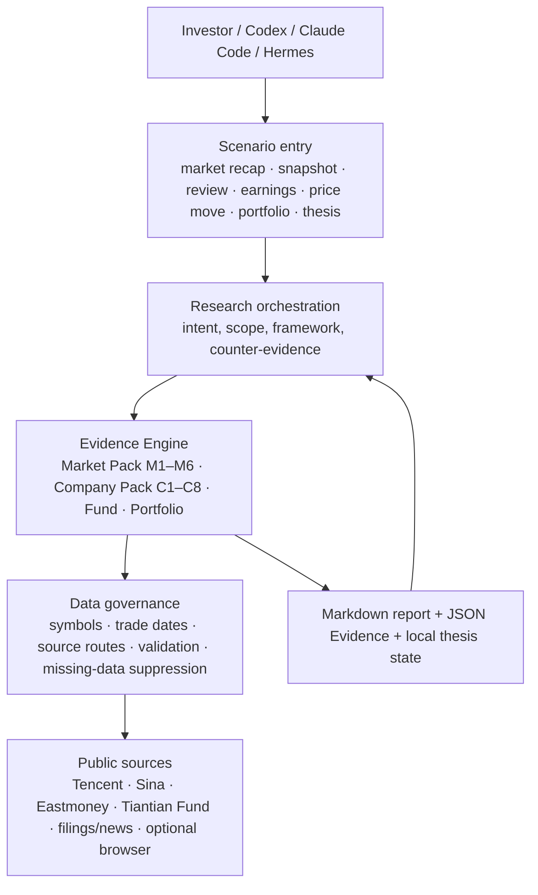
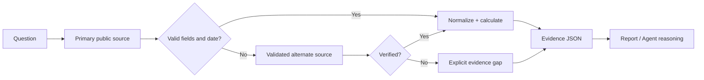

# stock-analysis

<div align="center">
  <a href="./README.md">English</a> |
  <a href="./README.zh-CN.md">简体中文</a>
</div>

<p align="center">
  
</p>

<p align="center">
  <strong>Evidence-first stock market analysis for AI agents, quant researchers, and investors who want auditable daily notes.</strong>
</p>

<p align="center">
  A/HK/US stocks · Funds · Portfolios · JSON Evidence Packs · Data-quality scoring · Multi-source fallback · Investor lenses
</p>

<p align="center">
  <a href="https://github.com/thuquant/awesome-quant"></a>
  <a href="https://github.com/leoncuhk/awesome-quant-ai"></a>
   <a href="https://github.com/wangzhe3224/awesome-systematic-trading"></a>
</p>

<p align="center">
  Listed in <a href="https://github.com/thuquant/awesome-quant">thuquant/awesome-quant</a> via merged PR
  <a href="https://github.com/thuquant/awesome-quant/pull/48">#48</a>.
</p>

<p align="center">
  Listed in <a href="https://github.com/leoncuhk/awesome-quant-ai">leoncuhk/awesome-quant-ai</a>
  under <em>Tools and Platforms / Data Providers</em> via merged PR
  <a href="https://github.com/leoncuhk/awesome-quant-ai/pull/39">#39</a>.
</p>

`stock-analysis` turns public market data into deterministic Markdown reports and machine-readable evidence. It is built for repeatable market recaps, not black-box trading signals.

```bash
uv tool install stock-analysis

stock-analysis --market daily
stock-analysis --market stock --symbol 600519
stock-analysis --market screen --fiscal-year 2025 --universe-file official_universe.json --filter roe_weighted:gt:8% --sort roe_weighted:desc
stock-analysis --market global --format full --with-holdings --emit-evidence
```

> The output is for research only and does not constitute investment advice.

## Why It Exists

Most market "AI analysis" starts with a prompt and ends with a fluent paragraph. `stock-analysis` starts with evidence:

- Fetch public market data across A-shares, Hong Kong stocks, US stocks, funds, and portfolios.
- Normalize symbols, timestamps, source metadata, and missing fields before writing conclusions.
- Score report quality from six evidence modules instead of pretending every data source worked.
- Emit JSON files that AI agents, notebooks, cron jobs, or human reviewers can inspect and diff.

If a data source fails, the report records the gap. Missing metrics stay missing; they are not filled with zeroes or guessed from nearby signals.

## Start with the investor question

Choose the investing question you have rather than assembling low-level flags. Each scenario starts with deterministic evidence (checkable prices, disclosed financial facts, or public events); an Agent may interpret it, but cannot bypass its source, trading-date, and completeness rules.

| If you need to… | Use it when… | Scenario | Deterministic entrypoint |
|---|---|---|---|
| Understand today's market | You want market context before, during, or after a trading session. | `/market-recap` | `--market daily` |
| Fact-check a ticker | You only need price, recent performance, turnover, and disclosed facts—not an opinion. | `/stock-snapshot` | `--market stock --symbol` |
| Decide whether a company merits more research | You are considering a position, a hold, or a structured fact check. | `/stock-review` | `--market stock-review --symbol` |
| See what actually changed after results | A quarterly or annual report has been released and you want disclosed financial facts. | `/earnings-review` | `--market earnings --symbol` |
| Investigate a sharp move cautiously | You want price, volume, and public events without treating a headline as proof of cause. | `/price-move` | `--market price-move --symbol` |
| Check whether holdings are too concentrated | You have already saved complete holdings information. | `/portfolio-review` | `--market portfolio` |
| Find A-shares meeting explicit financial conditions | You have hard conditions such as ROE or revenue growth and need repeatable results. | `/stock-screen` | `--market screen …` |
| Record and revisit your investment case | You have an investment hypothesis and want to check it against later facts. | `/thesis-create`, `/thesis-review` | `--market thesis-create|thesis-review --symbol` |

Claude Code supports native `/command` entrypoints. In Codex, Custom Prompts appear as `/prompts:stock-review`; after installing the generated Skills, an Agent can match a plain-language request such as “review Tencent” to the relevant Skill and run its deterministic command. Intent matching happens in the host Agent from the Skill description, not in the `stock-analysis` Python package. The same canonical catalog generates every entrypoint, so their workflow contract does not drift.

## How the system works



The essential boundary is deliberate: **the scenario chooses the research question, code obtains and validates evidence, and a lens only interprets the available evidence.** Market M1–M6 is for market/portfolio state; the separate C1–C8 Company Evidence Pack answers “what do we actually know about this company?” rather than treating market heat or a one-day move as a company fact.



## Agent installation

From a checkout, generate and verify the tracked entrypoints:

```bash
python3 scripts/sync_agent_entrypoints.py --check
scripts/install-agent-entrypoints.sh codex
scripts/install-agent-entrypoints.sh claude
```

The installer copies Codex Skills into `${CODEX_HOME:-~/.codex}/skills` and Claude commands into `${CLAUDE_CONFIG_DIR:-~/.claude}/commands`. It does not install data-source dependencies or modify a portfolio profile.

## Report Showcase

| Committee recap | Buffett recap | Simons recap |
|---|---|---|
| [2026-07-09 Investment committee recap](reports/20260709-投委会-行情复盘.md)<br> | [2026-07-09 Buffett recap](reports/20260709-巴菲特-行情复盘.md)<br> | [2026-07-09 Simons recap](reports/20260709-西蒙斯-行情复盘.md)<br> |

| Buffett stock lens | Simons stock lens | Fund profile |
|---|---|---|
| [Kweichow Moutai 600519](reports/20260709-巴菲特-贵州茅台600519.md)<br> | [Kweichow Moutai 600519](reports/20260709-西蒙斯-贵州茅台600519.md)<br> | [Semiconductor ETF 512480](reports/20260709-512480-半导体ETF基金分析.md)<br> |

Browse the [report directory](reports/) for the six 2026-07-09 Markdown reports, screenshots, social-share assets, and automation examples.

## What You Get

| Capability | What it means |
|---|---|
| Evidence Pack JSON | `evidence_YYYYMMDD.json` plus M1-M6 module files for audit, automation, and agent handoff. |
| A/HK/US/fund coverage | One CLI for broad market snapshots, single stocks, funds, and portfolio exposure. |
| Data-source routing | Tencent/Sina first where stable, Eastmoney for unique China-market data, browser fallback only when needed. |
| Quality scoring | Reports carry a 100-point evidence quality score and identify missing modules. |
| Investor lenses | Built-in Buffett, Munger, Graham, Simons, Dalio, Duan Yongping, Zhang Kun, and other structured lenses. |
| Portfolio memory | Optional local holdings profile with benchmark comparison, concentration risk, and FX normalization. |
| Deterministic A-share screening | Strict annual-report conditions with official-Universe gating, per-stock PASS/FAIL/UNKNOWN decisions, and one auditable Evidence JSON. |
| Guarded market-data evidence | Northbound flow requires a validated full-day sequence; fund profiles expose per-fund field coverage; listed A-shares/ETFs get 5d/20d/60d price-volume metrics and split-normalized premium/discount series when public samples are complete. |

## Quickstart

Install from PyPI:

```bash
uv tool install stock-analysis
stock-analysis --market daily
```

Run from a local checkout:

```bash
git clone https://github.com/AdvancingTitans/stock-analysis.git
cd stock-analysis
uv run stock-analysis --market daily
```

Common commands:

```bash
# Auto-select summary/key-points/full by Beijing market session
stock-analysis --market daily

# Full global recap with auditable JSON evidence
stock-analysis --market global --format full --emit-evidence

# Deterministic single-stock snapshot, no LLM required
stock-analysis --market stock --symbol 600519

# Use when you want a structured company fact check: it gives facts and gaps, not a buy score
stock-analysis --market stock-review --symbol 600519 --emit-evidence

# Use after a results release: disclosed structured financial facts only
stock-analysis --market earnings --symbol 600519 --emit-evidence

# Use after a sharp move: price, volume, and public events without asserting causality
stock-analysis --market price-move --symbol 600519 --emit-evidence

# Create and later compare a local structured thesis snapshot
stock-analysis --market thesis-create --symbol 600519
stock-analysis --market thesis-review --symbol 600519

# Deterministic fund snapshot with public profile and holdings data
stock-analysis --market fund --symbol 161725

# Deterministic A-share annual-report screen; requires a complete official Security Master snapshot
stock-analysis --market screen --fiscal-year 2025 --universe-file official_universe.json \
  --filter roe_weighted:gt:8% --filter revenue_growth_yoy:gt:8% \
  --sort roe_weighted:desc --limit 20 --emit-evidence

# Diagnose Tencent, Sina, Eastmoney, browser, and optional mootdx routes
stock-analysis --market diagnose
```

## Evidence Modules

### Company Evidence Pack (C1–C8)

Think of this as a “facts to check before doing more research” list. It is neither a stock screener nor an automatic buy/sell answer.

**When does it run?** Use `/stock-review` or `stock-analysis --market stock-review --symbol <symbol>` when you want to answer “should I spend more time researching or holding this company?” Running it does not create a portfolio, save an investment case, or assign a composite score. A thesis is saved locally only when you explicitly run `thesis-create`.

**What will you get?** The report separates checked facts, missing public data, and the next evidence you would need. For example, if financial quality and valuation facts are available, it shows their period and source. If there is not enough observable material on moat, management, or capital allocation, it says the evidence is missing instead of calling the company “high quality.”

| Module | Investor question | What it checks first |
|---|---|---|
| C1 Business quality | How does the company make money? | Quote, market, and available business facts; missing business breakdowns stay gaps. |
| C2 Financial quality | Are earnings and cash flow supported by disclosed facts? | Revenue, margins, ROE, leverage, operating cash flow, and free cash flow where disclosed. |
| C3 Growth quality | Is the claimed growth visible in disclosed numbers? | Structured revenue/profit history; it does not guess the source of growth. |
| C4 Moat evidence | Is there evidence for pricing power, stickiness, or cost advantage? | Observable evidence only; absent data is explicit. |
| C5 Management and capital allocation | Can buybacks, dividends, deals, dilution, or governance events be checked? | Available public events; no management verdict where coverage is absent. |
| C6 Valuation and margin of safety | What do price and valuation-related facts say today? | Quote, disclosed financial facts, and calculable metrics; never a “buy score.” |
| C7 Risk and counter-evidence | What facts would weaken the original case? | Price/volume anomalies, disclosed risks, and evidence gaps. |
| C8 Catalysts and thesis tracking | What public events should be revisited next? | News/event samples and the local-thesis review entrypoint. |

**Simplest choice:** run `stock-review` once, then read its available and missing modules. If you only want today’s price and recent movement, use `stock-snapshot`. If results have just been released, use `earnings-review`. If the price has moved sharply, use `price-move`. These are four different questions and should not substitute for one another.

Company research has a different data boundary from daily market recap. `company_evidence_<symbol>_<date>.json` stores C1–C8 verified facts and gaps. The current structured financial adapter is A-share focused; HK/US primary-filing fields intentionally remain gaps until a verified adapter exists, so those results are not a complete fundamental-research conclusion.

Every financial fact records its period, currency, accounting scope, source type, source, and confidence so that you can trace a number back to its origin. The metric registry at [`config/metric_registry.json`](config/metric_registry.json) declares how a metric is validated and which framework can use it. It never produces a composite “buy score.”

When `--emit-evidence` is enabled, the CLI writes:

```text
evidence_YYYYMMDD.json
m1_YYYYMMDD.json
m2_YYYYMMDD.json
m3_YYYYMMDD.json
m4_YYYYMMDD.json
m5_YYYYMMDD.json
m6_YYYYMMDD.json
```

The six-module score is designed for report trust, not performance marketing:

| Module | Focus | Weight |
|---|---:|---:|
| M1 | Cross-market index state, breadth, liquidity, benchmark context | 20 |
| M2 | Sector and concept rotation | 20 |
| M3 | Short-term sentiment and limit-up structure | 20 |
| M4 | Risk, failed breakouts, downside pressure | 15 |
| M5 | Portfolio exposure, style, concentration, holdings pulse | 15 |
| M6 | Resilient directions and next-session watchlist | 10 |

Full reports keep the same structure even when quality is low, but missing modules are called out naturally in the relevant section.

For current-day A-share reports, whole-market breadth is counted only after every Eastmoney `clist` page reconciles; a Sina `hs_a` fallback must paginate to EOF with unique valid codes. Historical reports keep strict breadth unavailable rather than relabeling industry-board components as all-market breadth. Tencent daily K lines add 5d/20d/60d returns, volume z-score, and ATR only when the sample is complete.

## Built For Agents

`stock-analysis` is intentionally agent-friendly:

- Deterministic CLI first; LLM layers can consume evidence later.
- Markdown for human review, JSON for machine workflows.
- Explicit source events and fallback reasons.
- Stable command surface for cron jobs, notebooks, Hermes, Codex, Claude Code, and other tool-calling agents.

Example agent prompt:

```text
Run stock-analysis --market global --format full --emit-evidence.
Use the Markdown report for the user-facing recap.
Use evidence_YYYYMMDD.json to verify every strong conclusion before summarizing.
If a module is missing, say which evidence was unavailable instead of guessing.
```

See [examples/agent.md](examples/agent.md) for a daily agent workflow and [examples/github-actions-daily-recap.yml](examples/github-actions-daily-recap.yml) for a scheduled GitHub Actions recap that uploads the report plus Evidence Pack.

## What It Is Not

- Not a trading bot.
- Not a broker integration.
- Not a promise of complete market data.
- Not a replacement for professional financial advice.
- Not a black-box LLM report generator.

## Data Source Strategy

| Scenario | Primary route | Fallback route |
|---|---|---|
| A-share quotes and valuation | Tencent → Sina | Eastmoney `stock/get` |
| A-share indices | Tencent → Sina | Eastmoney index endpoints |
| Board rankings | Eastmoney `clist` | Tonghuashun public pages → browser fallback |
| HK quotes | Tencent/Sina | Eastmoney `stock/get` |
| US quotes | Sina/Tencent | Eastmoney `searchapi` → `stock/get` |
| Funds | Eastmoney/Tiantian fund pages | Sina fund fallback |
| Deep tick/order-book data | Optional `mootdx` | Basic Tencent/Sina quotes |

Yahoo is intentionally not part of the recommended default path.

## Investor Lenses

The lens engine can render the same evidence through different investment frameworks. Supported lenses include:

`buffett`, `munger`, `graham`, `klarman`, `lynch`, `o_neil`, `wood`, `dalio`, `soros`, `livermore`, `minervini`, `simons`, `duan_yongping`, `zhang_kun`, and `feng_liu`.

Lenses change evidence priority and narrative structure. They do not override data quality rules or invent missing numbers.

### Built-in Lens and Committee Boundaries

Current CLI version: `4.5.0`.

`LensEngine` is the report orchestration layer. The default mode is `committee`, which combines M1-M6 evidence into a deeper cross-module analysis. Natural-language callers can ask for requests such as "analyze Kweichow Moutai in Buffett mode" or "run an adversarial debate between Buffett and Munger on Tencent." If `committee` mode fails, the engine falls back to `single` mode and preserves the fallback reason in metadata.

Committee reports use a fixed spine: executive summary → market index overview → portfolio analysis when complete holdings are available → six-module deep recap → integrated portfolio guidance and risk notes. The closing guidance should cover the current state, benchmark outperformance or underperformance, conditional position actions, the next-session watchlist, and key risks. Evidence appendices stay outside the morning, intraday, midday, and after-close narrative body. If any M1-M6 module is missing, the relevant section must say that the evidence is unavailable.

`--market stock --symbol <code>` and `--market fund --symbol <code>` are deterministic evidence views. They do not require users to install any external quote CLI. Browser routes are fallback-only paths for repeated API failures or page-only data. Engineering details belong in evidence and diagnose output, not in the user-facing report body.

Northbound flow is shown only after a current-day full-session validation (coverage through 14:50, sufficient minute samples, and a sane opening baseline). Historical or incomplete streams remain unavailable. Fund-profile completeness is evaluated for every fund and every field, so an ETF with no published fee values cannot be compared as if fees were known. Board rankings carry their source taxonomy, and classifications from different providers are not comparable without normalization.

Listed-fund premium/discount uses Tencent forward-adjusted daily closes against paginated official NAV. Public share-split events are normalized before the two series are compared; any unparseable corporate action suppresses the series. A fund-page annualized tracking-error value is labeled as disclosed metadata, never as a locally recomputed daily tracking error.

Fund profiles use Tiantian Fund's public `pingzhongdata` page to supplement long-term performance, front-end fees, fund size, and fund manager context. This path does not require login or an API key. Fund snapshots should show long-term performance, front-end fees, fund manager information, and any disclosed gaps.

Investment memory defaults to `~/.stock_analysis/profile.json` and can be overridden with `STOCK_ANALYSIS_PROFILE`. A complete holding must include the symbol, buy date, and either share quantity or purchase amount. If newly supplied user information conflicts with saved investment memory, confirm that the new information is complete, then prefer the user's latest input and overwrite the saved memory.

When a user explicitly asks for a specific investor style, the whole report must be written from that lens. Do not merely append an expert comment at the end. Single-expert and multi-expert reports have different structures, but neither should impersonate an investor or fabricate expert quotes.

## Contributing

Good first contributions:

- Add or harden a public data-source adapter.
- Improve a report template or investor lens.
- Add examples for a new region, symbol type, or agent workflow.
- Report a source failure with `--market diagnose` output.
- Submit this project to a high-fit Awesome List or agent tool directory.

Start with [CONTRIBUTING.md](CONTRIBUTING.md) and [ROADMAP.md](ROADMAP.md).

## Awesome List Blurb

Use this one-liner when submitting the project to curated lists:

> [stock-analysis](https://github.com/AdvancingTitans/stock-analysis) - Evidence-driven market recap CLI for AI agents and quant researchers, supporting A/HK/US stocks, funds, portfolios, auditable JSON Evidence Packs, data-quality scoring, investor lenses, and multi-source fallback routing.

High-fit targets include `awesome-quant-ai`, `awesome-ai-in-finance`, `awesome-quant`, and `awesome-systematic-trading`.

## Development

```bash
uv sync
uv run --with pytest pytest -q
uv run --with ruff ruff check
```

## License

MIT

This project is for research only and does not constitute investment advice. Markets involve risk.
