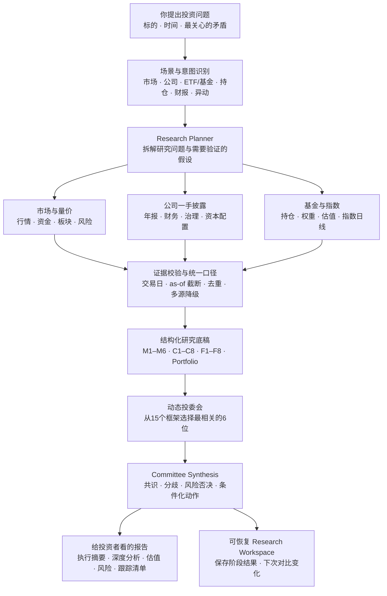
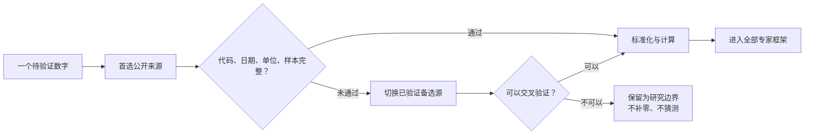

# stock-analysis

<div align="center">
  <a href="./README.md">English</a> |
  <a href="./README.zh-CN.md">简体中文</a>
</div>

<p align="center">
  
</p>

<p align="center">
  <strong>把一句投资问题，变成一份有数据、有分歧、有条件的机构化研究报告。</strong>
</p>

<p align="center">
  A 股 / 港股 / 美股 · 个股 · ETF / 基金 · 持仓组合 · 动态投委会 · 一手披露 · 多源校验
</p>

<p align="center">
  <a href="https://github.com/thuquant/awesome-quant"></a>
  <a href="https://github.com/leoncuhk/awesome-quant-ai"></a>
  <a href="https://github.com/wangzhe3224/awesome-systematic-trading"></a>
  <a href="https://github.com/0xNyk/awesome-hermes-agent"></a>
</p>

<p align="center">
  已通过 PR <a href="https://github.com/thuquant/awesome-quant/pull/48">#48</a> 收录到
  <a href="https://github.com/thuquant/awesome-quant">thuquant/awesome-quant</a>。
</p>

<p align="center">
  已通过 PR <a href="https://github.com/leoncuhk/awesome-quant-ai/pull/39">#39</a> 收录到
  <a href="https://github.com/leoncuhk/awesome-quant-ai">leoncuhk/awesome-quant-ai</a> 的
  <em>Tools and Platforms / Data Providers</em>。
</p>

<p align="center">
  已通过 PR <a href="https://github.com/wangzhe3224/awesome-systematic-trading/pull/124">#124</a> 收录到
  <a href="https://github.com/wangzhe3224/awesome-systematic-trading">wangzhe3224/awesome-systematic-trading</a>。
</p>

<p align="center">
  已通过合并的 PR <a href="https://github.com/0xNyk/awesome-hermes-agent/pull/232">#232</a> 收录到
  <a href="https://github.com/0xNyk/awesome-hermes-agent">0xNyk/awesome-hermes-agent</a>。
</p>

如果你经常有这些疑问：

- 贵州茅台跌到这个位置，究竟是估值机会，还是增长逻辑正在变化？
- 半导体 ETF 一年涨了很多，现在买入承担的是产业机会，还是高估值与拥挤交易？
- 财报发布后，利润、现金流、分红和资本配置到底发生了什么？
- 我的持仓看起来有十只股票，实际是不是都押在同一个风格上？

`stock-analysis` 希望帮你完成最耗时间的第一步：先找公开数据和一手披露，统一交易日与口径，再让最适合当前问题的 6 位投资框架组成投委会。最终交付不是一句“买入/卖出”，而是一份包括事实、估值、风险、分歧和条件化动作的中文研究报告。

不懂 Python 也可以使用。安装 Skill 后，在 Codex、Claude Code 或 Hermes 里直接说中文即可：

```text
深度分析半导体ETF 512480。重点回答当前估值是否透支景气，
标的指数最近一年的趋势和回撤如何，100万元买卖一次大约承担多少交易成本。
请自动选择最合适的6位专家组成投委会，并输出最终研究报告。
```

你也可以使用确定性 CLI：

```bash
uv tool install stock-analysis

stock-analysis --market daily
stock-analysis --market stock --symbol 600519
stock-analysis --market screen --fiscal-year 2025 --universe-file official_universe.json --filter roe_weighted:gt:8% --sort roe_weighted:desc
stock-analysis --market research --symbol 512480 --asset-type fund
```

> 输出仅供研究参考，不构成投资建议。

## 72 秒演示

- [简体中文视频](promo/demo-video/out/stock-analysis-demo-zh-CN.mp4)
- [English video](promo/demo-video/out/stock-analysis-demo-en.mp4)

两个演示均为 1080p、72 秒，以字幕传递完整信息，静音也能观看。当前版本已展示动态6人投委会、官方年报、指数日线、tracking error 与交易成本；可编辑的 Remotion 工程位于 [`promo/demo-video`](promo/demo-video/)。

## 为什么需要它

很多 AI 投资工具的起点是“让几个 Agent 讨论一下”，终点是一段很流畅的观点。真正让投资者难受的却是中间缺失的部分：数字属于哪个报告期？基金买的究竟是什么指数？网页披露的 tracking error 能否复算？买入 100 万元后，价差和冲击会吃掉多少收益？

`stock-analysis` 的顺序是：**先建立证据，再选择框架，最后形成观点。**

| 常见方案 | 更擅长什么 | stock-analysis 的不同选择 |
|---|---|---|
| 通用聊天机器人 | 快速解释概念、生成流畅文字 | 先运行确定性数据流程；日期、来源和缺失项必须过校验后才能进入报告 |
| [OpenBB](https://github.com/OpenBB-finance/OpenBB) 一类数据平台 | 广泛的数据接入和研究接口 | 更专注中国投资者拿来即用的研究场景、中文报告和 Agent 提示词 |
| [TradingAgents](https://github.com/TauricResearch/TradingAgents)、[ai-hedge-fund](https://github.com/virattt/ai-hedge-fund) 一类多 Agent 框架 | 角色协作、交易研究实验 | 委员不是固定阵容；系统根据问题从 15 个框架中选择 6 位，并要求每位委员读取同一批结构化指标 |
| [FinGPT](https://github.com/AI4Finance-Foundation/FinGPT) 一类金融模型项目 | 金融语言模型、情绪和训练研究 | 不要求训练模型；重点是一手披露、市场数据、基金指数和可恢复的研究流程 |

项目目前尤其重视这些容易被普通研报忽略的细节：

- 公司研究读取结构化财务、官方年报 PDF、治理与资本配置事实；净利率和经营现金转化会进入每位委员的框架。
- ETF 研究不只看基金净值和前十大持仓，还读取官方指数样本、权重、估值和日线，重算相关系数、beta、tracking error、回撤与波动。
- 股票与 ETF 使用同一套订单成本情景，区分价差、佣金、经手费、过户费、适用印花税和市场冲击。
- 同一标的下次再研究时，可以保留上次结果并观察“什么发生了变化”。

如果数据源失败，缺失指标保持缺失，不会用 `0` 回填，也不会把单日涨跌包装成基本面结论。

## 从投资问题开始

先选择你遇到的投资问题，而不是拼凑底层参数。每个场景先生成确定性证据（可回查的价格、已披露财务或公开事件）；Agent 可以解释证据，但不能绕过来源、交易日和完整性校验。

| 你现在要解决的问题 | 什么时候用 | 场景入口 | 确定性 CLI |
|---|---|---|---|
| 今天市场发生了什么 | 开盘前、盘中或收盘后想先掌握市场背景 | `/market-recap` | `--market daily` |
| 核对一个标的的事实 | 只想看现价、近期涨跌、成交和已披露财务，不想要观点 | `/stock-snapshot` | `--market stock --symbol` |
| 这家公司是否值得继续花时间研究 | 准备建仓、继续持有或做一次更系统的事实核对 | `/stock-review` | `--market stock-review --symbol` |
| 财报出来后，哪些数字真的变了 | 已发布季报/年报后，只复核公开披露的财务事实 | `/earnings-review` | `--market earnings --symbol` |
| 一只股票突然涨跌，先发生了什么 | 想区分价格、成交和公开事件，避免把新闻直接当原因 | `/price-move` | `--market price-move --symbol` |
| 我的持仓是否过于集中 | 已保存完整持仓资料后检查集中度、市场和币种暴露 | `/portfolio-review` | `--market portfolio` |
| 找出满足明确财务条件的 A 股 | 已有 ROE、营收增速等硬条件，且希望结果可重复 | `/stock-screen` | `--market screen …` |
| 留下并复查自己的投资理由 | 已经形成投资假设，想在以后用新事实重新核对 | `/thesis-create`、`/thesis-review` | `--market thesis-create|thesis-review --symbol` |
| 运行可恢复的机构化研究流程 | 需要阶段产物可中断恢复、审计，并与上次研究比较 | `/research-workspace` | `--market research --symbol` |

Claude Code 原生支持 `/command` 入口。Codex 的 Custom Prompt 显示为 `/prompts:stock-review`；安装生成的 Skill 后，Agent 可以根据 Skill 描述把“分析腾讯”这类自然语言请求匹配到相应 Skill，并执行其中的确定性命令。意图识别发生在宿主 Agent，而非 `stock-analysis` Python 包内部。所有入口均从同一份 canonical catalog 生成，避免工作流漂移。

## 系统如何工作



对普通投资者来说，可以把它理解成四步：

1. 你用自然语言说清楚“研究谁”和“最想解决什么问题”。
2. 系统按场景寻找数据，并拒绝使用研究日期之后才披露的信息。
3. 从 15 个投资框架中挑选最匹配问题的 6 位组成投委会；不是每次都让同一批人发表模板化观点。
4. 报告先给结论，再给支持数字、核心分歧、反证条件和后续观察指标。

核心边界是：**问题决定研究路径，代码负责取得和校验证据，投资框架只能解释已经存在的数据。** M1–M6 服务市场与组合；C1–C8 回答公司本身；F1–F8 回答基金合同、指数暴露、估值、跟踪与交易实现。



## Agent 安装

### 不会编程：把这段话发给你的 Agent

在 Codex、Claude Code 或 Hermes 中粘贴：

```text
请帮我安装 https://github.com/AdvancingTitans/stock-analysis：
1. 克隆仓库；
2. 用 uv 安装 stock-analysis；
3. 运行仓库里的 Agent entrypoint 安装脚本；
4. 检查 stock-analysis --help 和内置 Skill 是否可用；
5. 不要改动我的其他项目文件，完成后告诉我可以直接使用的三个中文提示词。
```

Agent 完成后，你不需要记命令。直接说“深度分析 600519”“复盘今天 A 股”“分析我的持仓”即可。意图识别发生在宿主 Agent，`stock-analysis` 负责取得和校验数据。

### 熟悉终端：三步安装

```bash
git clone https://github.com/AdvancingTitans/stock-analysis.git
cd stock-analysis
uv tool install stock-analysis
python3 scripts/sync_agent_entrypoints.py --check
scripts/install-agent-entrypoints.sh codex
scripts/install-agent-entrypoints.sh claude
```

只使用 CLI 时，执行 `uv tool install stock-analysis` 即可。Agent 安装器只复制 Codex Skills 到 `${CODEX_HOME:-~/.codex}/skills`、Claude commands 到 `${CLAUDE_CONFIG_DIR:-~/.claude}/commands`；不会修改已有持仓记忆。

## 安装后，推荐这样提问

好的提示词不需要写技术参数，只需要说清楚四件事：**标的、研究时点、核心问题、希望如何决策。**

### 1. 每日市场复盘

```text
复盘今天A股收盘。先判断指数、市场广度、板块轮动和风险偏好，
再结合我的持仓说明哪些方向跑赢或跑输基准，最后给出明天的观察清单。
不要把缺失数据写成0，也不要只复述新闻。
```

### 2. 个股深度研究

```text
深度分析贵州茅台600519。核心问题是当前19倍左右估值能否被未来三年的盈利、
现金流和股东回报支撑。请核对年报一手披露、净利率、经营现金转化、分红、
资本配置和交易成本，自动选择最合适的6位专家组成投委会。
```

### 3. ETF / 基金研究

```text
研究半导体ETF国联安512480。不要只看过去涨幅和前十大持仓，
请核对标的指数完整成分、权重、估值和日线，重算跟踪误差、回撤与波动，
并估算10万、100万、500万元订单的往返成本。最后说明适合怎样的组合角色。
```

### 4. 财报复核

```text
复核600519最新财报。把收入、利润、毛利率、ROE、经营现金流、自由现金流、
分红和资本开支与上一报告期对比。区分已披露事实、合理推断和仍需验证的经营问题。
```

### 5. 持仓诊断

```text
分析我的持仓：600519 100股，买入日期2026-06-01；512480 10万份，
买入日期2026-05-20。请检查行业、风格、市场和币种集中度，比较基准表现，
并分别给出继续持有、降低风险或等待验证所需要满足的条件。
```

### 6. 指定框架或让两种框架辩论

```text
用巴菲特模式分析腾讯，重点看商业质量、资本配置和长期现金流。
```

```text
用 adversarial 模式让巴菲特和芒格辩论腾讯：一方论证长期价值，
另一方专门寻找治理、估值和机会成本上的反证，最后由组合经理总结。
```

## 报告示例

建议先看两份最新报告，它们最能体现当前版本与普通 AI 研报的区别：

| 场景 | 报告里真正解决的问题 | 示例 |
|---|---|---|
| 贵州茅台个股研究 | 年报一手披露、净利率、现金转化、分红与资本配置、估值敏感性、交易成本如何共同影响结论 | [600519 动态投委会深度报告](reports/final-validation-v412-r2/600519/20260717/07-institutional-report.md) |
| 半导体 ETF 研究 | 完整指数成分与估值、146个指数日线样本、严格对齐后的 tracking error、回撤、波动及订单成本 | [512480 动态投委会深度报告](reports/final-validation-v412-r2/512480/20260717/07-institutional-report.md) |
| 全球市场复盘 | 指数、广度、板块、风险、持仓与下一交易日观察清单 | [投委会行情复盘](reports/20260709-投委会-行情复盘.md) |

<p align="center">
  
  
  
</p>

更多报告、截图、社交分享素材和自动化示例见 [reports/](reports/)。

## 你会得到什么

| 能力 | 含义 |
|---|---|
| 读得懂的中文投委会报告 | 先给执行摘要，再讲商业/指数逻辑、财务或持仓、估值、专家分歧、风险与条件化动作。 |
| 动态6人投委会 | 根据研究问题从15个框架中选择最匹配的6位，不再固定让同一组专家回答所有问题。 |
| 公司一手披露 | 通过可扩展规则读取官方年报 PDF，把经营、治理、分红和资本配置事实送入所有专家框架。 |
| 深度 ETF 研究 | 同时研究基金和标的指数，包含完整成分、权重、估值、指数日线、tracking error、折溢价和成本情景。 |
| A 股 / 港股 / 美股 / 基金 / 持仓 | 一套入口覆盖市场复盘、单股、基金、财报、异动、筛选、持仓与投资论文。 |
| 多源校验与时间边界 | 优先使用稳定公开源；来源失败时自动降级；历史研究不会偷看未来披露。 |
| 可恢复研究工作区 | 分阶段保存研究计划、底稿、专家意见、委员会结论和最终报告，支持下次复查变化。 |
| 人机两用结果 | Markdown 给投资者阅读，JSON Evidence Pack 给 Agent 校验、自动化和复用。 |

## 快速开始

从 PyPI 安装：

```bash
uv tool install stock-analysis
stock-analysis --market daily
```

从本地仓库运行：

```bash
git clone https://github.com/AdvancingTitans/stock-analysis.git
cd stock-analysis
uv run stock-analysis --market daily
```

常用命令：

```bash
# 按北京时间市场阶段自动选择 summary/key-points/full
stock-analysis --market daily

# 带 JSON 证据的完整全球市场复盘
stock-analysis --market global --format full --emit-evidence

# 确定性的单股快照，不依赖 LLM
stock-analysis --market stock --symbol 600519

# 想系统核对一家公司时使用：输出公司事实和明确缺口，不给综合买入分
stock-analysis --market stock-review --symbol 600519 --emit-evidence

# 财报发布后使用：仅复核已披露的结构化财务事实
stock-analysis --market earnings --symbol 600519 --emit-evidence

# 股价突然涨跌时使用：列出量价和公开事件，但不把相关性断言为因果
stock-analysis --market price-move --symbol 600519 --emit-evidence

# 建立并复查本地结构化投资论文快照
stock-analysis --market thesis-create --symbol 600519
stock-analysis --market thesis-review --symbol 600519

# 创建或恢复分阶段机构研究工作区
stock-analysis --market research --symbol 600519
stock-analysis --market research --symbol 512480 --asset-type fund

# 带公开画像和持仓数据的基金快照
stock-analysis --market fund --symbol 161725

# 确定性 A 股年报选股；必须提供完整的官方 Security Master 快照
stock-analysis --market screen --fiscal-year 2025 --universe-file official_universe.json \
  --filter roe_weighted:gt:8% --filter revenue_growth_yoy:gt:8% \
  --sort roe_weighted:desc --limit 20 --emit-evidence

# 诊断 Tencent、Sina、Eastmoney、browser 和可选 mootdx 路由
stock-analysis --market diagnose
```

## 证据模块

### Company Evidence Pack（C1–C8）

把它理解为一份“继续研究前的事实清单”，不是选股器，也不是自动给出买卖答案。

**什么时候触发？** 当你准备回答“我是否要继续研究/持有这家公司？”时，运行 `/stock-review` 或 `stock-analysis --market stock-review --symbol <代码>`。它不会因你输入一个代码就自动创建持仓、保存投资理由或给出综合评分；只有你明确运行 `thesis-create` 时，才会在本地保存一份论文快照。

**它会给你什么？** 报告逐项列出已经核验到的事实、还没有公开或尚未接入的数据，以及下一步该补什么。例如：财务质量和估值数据可用时会列出对应期间和来源；护城河、管理层与资本配置没有足够可观察资料时，会直接写“证据暂缺”，而不是用“优质公司”之类的主观判断代替。

| 模块 | 用投资者语言回答的问题 | 当前会优先核对的内容 |
|---|---|---|
| C1 商业质量 | 它靠什么赚钱？ | 报价、市场和可获得的业务事实；业务拆分不足会保留缺口。 |
| C2 财务质量 | 赚的钱和现金流是否有公开证据支持？ | 已披露营收、利润率、ROE、负债、经营现金流、自由现金流等。 |
| C3 增长质量 | 增长是否能从已披露数字中看出来？ | 收入和利润等结构化历史数据；无法拆解的增长来源不猜测。 |
| C4 护城河证据 | 定价权、客户黏性或成本优势有数据支持吗？ | 只采用可观察证据；没有资料就明确缺失。 |
| C5 管理层与资本配置 | 回购、分红、并购、稀释或治理事件是否可核对？ | 已接入的公开事件；未覆盖时不作管理层评价。 |
| C6 估值与安全边际 | 当前价格、估值相关事实和条件是什么？ | 报价、已披露财务事实和可计算指标；不输出“买入评分”。 |
| C7 风险与反证 | 哪些事实会削弱原先的判断？ | 量价异常、已披露风险及证据缺口。 |
| C8 催化剂与论文跟踪 | 接下来有什么公开事件值得复查？ | 新闻/事件样本与本地论文快照的复查入口。 |

**最简单的用法：** 先运行一次 `stock-review`，阅读“可用模块”和“缺失模块”；若你只是想确认今天价格和近期表现，用 `stock-snapshot` 即可；若财报刚发布，优先用 `earnings-review`；若价格突变，优先用 `price-move`。这是四个不同的问题，不能互相替代。

公司研究和每日市场复盘使用不同的数据边界。`company_evidence_<symbol>_<date>.json` 保存 C1–C8 的可验证事实和缺口；当前结构化财务适配器以 A 股为主。港美股的原始披露字段在接入可验证适配器前会明确保留为缺口，因此它们不应被当作完整的基本面研究结论。

### 可恢复 Research Workspace

`stock-analysis --market research --symbol <代码>` 会在 `~/.stock_analysis/research/<symbol>/<trade_date>/` 下实体化机构化研究流程（可用 `STOCK_ANALYSIS_RESEARCH_DIR` 或 `--workspace-dir` 覆盖）。股票研究冻结 C1–C8 Company Evidence；基金研究使用 `--asset-type fund`（或由 auto 识别常见场内基金前缀），冻结独立的 F1–F8 Fund Evidence，覆盖产品契约、持仓集中度、业绩、跟踪与折溢价、底层估值缺口、风险、治理和跟踪条件。所有 lens 与 committee 必须消费同一内容寻址快照。同一日期重复运行会保护人工修改，并把新结果写到 `.generated` 文件。

Company opinions 是确定性的框架复核，不是模拟专家发言：所有支持与反证都必须引用同一个冻结 `snapshot_id` 中的 `evidence_id`。committee 会拒绝混用不同快照，保留共识、分歧和 risk veto，只输出 `observe` 或 `manual_review`，不会自动推导仓位或交易动作。现有源补充了结构化财报/预告/快报、PE/PB/市值、融资现金流，以及治理/资本配置公告索引；聚合记录在回查公司或交易所原文前仍保持 secondary。

每个财务事实都会记录期间、币种、会计范围、来源类型、来源和置信度，方便你回查数字来自哪里。[`config/metric_registry.json`](config/metric_registry.json) 规定指标如何校验、可被哪些框架使用；它不会输出综合“买入评分”。

启用 `--emit-evidence` 后，CLI 会写出：

```text
evidence_YYYYMMDD.json
m1_YYYYMMDD.json
m2_YYYYMMDD.json
m3_YYYYMMDD.json
m4_YYYYMMDD.json
m5_YYYYMMDD.json
m6_YYYYMMDD.json
```

六模块评分关注的是报告可信度，不是收益宣传：

| 模块 | 关注点 | 权重 |
|---|---:|---:|
| M1 | 跨市场指数状态、广度、流动性、基准背景 | 20 |
| M2 | 行业和概念轮动 | 20 |
| M3 | 短线情绪和涨停结构 | 20 |
| M4 | 风险、突破失败、下行压力 | 15 |
| M5 | 持仓暴露、风格、集中度、持仓脉冲 | 15 |
| M6 | 韧性方向和下一交易日观察清单 | 10 |

即使质量评分偏低，完整报告也会保持相同结构；缺失模块会在相关章节自然说明。

当前交易日的 A 股全市场广度，优先要求东财 `clist` 的每一页、服务端总数和有效行数全部对账；若连接失败，Sina `hs_a` 必须分页至空页/短页，并核对唯一代码和有效行数。历史日期保留“不可用”，不会把行业板块成分汇总冒充全市场。Tencent 日 K 线样本齐全时，Evidence 还会提供 5d/20d/60d 收益、成交量 z-score 与 ATR。

## 为 Agent 而设计

`stock-analysis` 对工具调用友好：

- 先有确定性 CLI，LLM 层可以后续消费 evidence。
- Markdown 给人看，JSON 给机器工作流用。
- 明确记录来源事件和 fallback 原因。
- 命令界面稳定，适合 cron、notebook、Hermes、Codex、Claude Code 和其他工具调用型 Agent。

示例 Agent prompt：

```text
Run stock-analysis --market global --format full --emit-evidence.
Use the Markdown report for the user-facing recap.
Use evidence_YYYYMMDD.json to verify every strong conclusion before summarizing.
If a module is missing, say which evidence was unavailable instead of guessing.
```

日常 Agent 工作流见 [examples/agent.md](examples/agent.md)，定时生成报告并上传 Evidence Pack 的 GitHub Actions 示例见 [examples/github-actions-daily-recap.yml](examples/github-actions-daily-recap.yml)。

## 它不是什么

- 不是交易机器人。
- 不是券商接口。
- 不承诺覆盖所有市场数据。
- 不能替代专业投资建议。
- 不是黑箱 LLM 报告生成器。

## 数据源策略

| 场景 | 主路径 | 降级路径 |
|---|---|---|
| A 股行情和估值 | Tencent → Sina | Eastmoney `stock/get` |
| A 股指数 | Tencent → Sina | Eastmoney index endpoints |
| 板块排行 | Eastmoney `clist` | Tonghuashun public pages → browser fallback |
| 港股行情 | Tencent/Sina | Eastmoney `stock/get` |
| 美股行情 | Sina/Tencent | Eastmoney `searchapi` → `stock/get` |
| 基金 | Eastmoney/Tiantian fund pages | Sina fund fallback |
| 深度 tick / order-book 数据 | Optional `mootdx` | Basic Tencent/Sina quotes |

Yahoo 不是推荐默认路径的一部分，这是有意为之。

## 投资者 Lens

Lens engine 可以把同一份 evidence 按不同投资框架组织成报告。当前支持：

`buffett`, `munger`, `graham`, `klarman`, `lynch`, `o_neil`, `wood`, `dalio`, `soros`, `livermore`, `minervini`, `simons`, `duan_yongping`, `zhang_kun`, `feng_liu`.

Lens 会改变证据优先级和叙事结构，但不会绕过数据质量规则，也不会编造缺失数字。

### 内置 lens 与 committee 边界

当前 CLI 版本为 `4.12.0`。

`research` 报告保留 4.5 系列的中文投委会分析密度，并把可恢复、可追溯的研究状态留在 Workspace 内部。个股沿用“执行摘要 → 行情与商业质量 → 财务增长 → 治理与资本配置 → 估值情景 → 投委会审议 → 风险催化 → 条件化动作”；基金沿用“执行摘要 → 产品与指数契约 → 持仓暴露 → 业绩风险 → 估值与交易实现 → 投委会审议 → 风险催化 → 条件化动作”。用户报告不显示 Coverage、Missing module、内部 action、快照 ID 或审计术语。

LensEngine 是报告生成的核心编排器。`research` 默认使用 committee 模式，并根据用户问题从 15 个内置 lens 中选择最相关且互补的 6 位委员；用户显式指定专家时尊重用户选择。每位委员都会读取同一研究时点的全部结构化指标，再按自己的投资框架解释。自然语言调用也可表达为“用巴菲特模式分析贵州茅台”或“用 adversarial 模式让巴菲特和芒格辩论腾讯”；committee 失败时降级为 single，并在内部 metadata 保留原因。

Company 一手披露采用可扩展的“官方 PDF → 指定页文本 → JSON 正则规则 → C1–C8”适配器。600519 的经营、渠道、分红、回购、审计意见与产能数据已从年报原文实时抽取；新增发行人只需增加规则目录，不再修改报告生成代码或硬编码数值。

512480 通过中证指数官方文件读取 H30184 的完整样本、月末权重、每日指数估值和标的指数日线。ETF 与指数按交易日严格对齐后重算相关系数、beta、tracking error 和主动收益。股票、基金与组合持仓共用同一成本情景模型，覆盖价差、佣金、经手/过户费、适用印花税、20 日成交额参与率和波动率冲击。

`committee` 报告有固定骨架：执行摘要 → 大盘指数概览 → 持仓分析（有完整持仓时）→ 六模块深度复盘 → 综合持仓建议与风险提示。结尾建议需要覆盖现状总结、基准跑赢/跑输、条件化仓位动作、下一交易日观察清单和风险提示。证据附录不进入早盘、盘中、午间或盘后正文；如果 M1-M6 某个模块缺失，相关章节必须说明证据暂缺。

`--market stock --symbol <code>` 和 `--market fund --symbol <code>` 是确定性证据视图，不要求用户安装任何外部行情 CLI。浏览器路径只作为 API 连续失败或页面独有数据的降级路径；工程细节进入 evidence/diagnose，不进入正文。

北向资金只有在当前交易日的序列覆盖至 14:50 后、分钟样本充足且开盘基线合理时才展示绝对值；历史或半截序列保持不可用。基金画像按每只基金、每个字段核验，因此 ETF 未返回费率时不会被当作可比费率。板块榜同时记录来源 taxonomy，未经归一不能把不同提供方的分类直接横向比较。

场内基金折溢价使用腾讯前复权日 K 线和天天基金官方历史净值分页逐日对齐；公开份额拆分会先归一，无法解析的公司行为则不生成序列。基金页面的年化跟踪误差只作为披露元数据展示，不冒充本工具按日重算的 tracking error。

基金画像通过天天基金公开评估页 `pingzhongdata` 补充长期业绩、前端费率、规模和基金经理画像；该路径不依赖登录或 API key。基金速览应展示长期业绩、前端费率、基金经理信息和已披露缺口。

投资记忆默认路径为 `~/.stock_analysis/profile.json`，也可以用 `STOCK_ANALYSIS_PROFILE` 覆盖。完整持仓必须同时具备股票代码、买入日期、买入数量或买入金额。若用户新提供的信息与之前保存的投资记忆不一致，确认信息完整性后，优先以用户新提供的信息为准，并覆盖写入投资记忆。

当用户明确提出想用哪位投资专家的风格时，整篇报告都必须完全以相关专家的视角输出报告，不得只在结尾追加专家点评。单专家视角和多专家综合的结构不同，但都不得模仿身份声明或虚构专家发言。

## 贡献

适合上手的贡献方向：

- 新增或加固公开数据源 adapter。
- 改进报告模板或投资者 lens。
- 为新的地区、标的类型或 Agent 工作流补充示例。
- 带着 `--market diagnose` 输出报告数据源失效。
- 把项目提交到匹配度高的 Awesome List 或 Agent 工具目录。

请先阅读 [CONTRIBUTING.md](CONTRIBUTING.md) 和 [ROADMAP.md](ROADMAP.md)。

## Awesome List 简介

提交到精选列表时，可以使用这句简介：

> [stock-analysis](https://github.com/AdvancingTitans/stock-analysis) - Evidence-driven market recap CLI for AI agents and quant researchers, supporting A/HK/US stocks, funds, portfolios, auditable JSON Evidence Packs, data-quality scoring, investor lenses, and multi-source fallback routing.

适合目标包括 `awesome-quant-ai`、`awesome-ai-in-finance`、`awesome-quant` 和 `awesome-systematic-trading`。

## 开发

```bash
uv sync
uv run --with pytest pytest -q
uv run --with ruff ruff check
```

## License

MIT

以上内容仅供研究参考，不构成任何投资建议。股市有风险，投资需谨慎。
