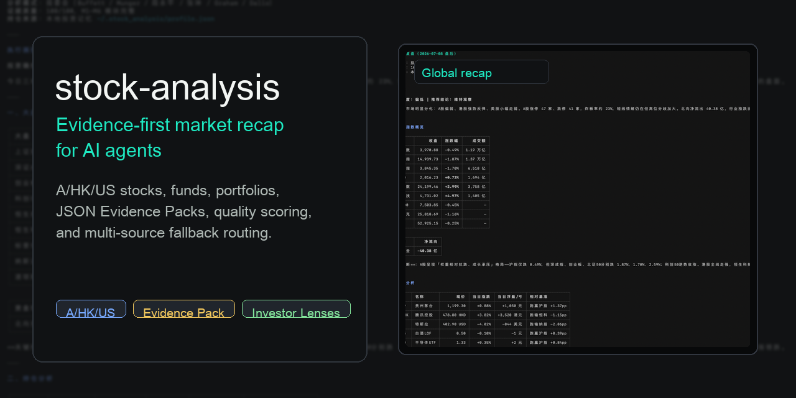
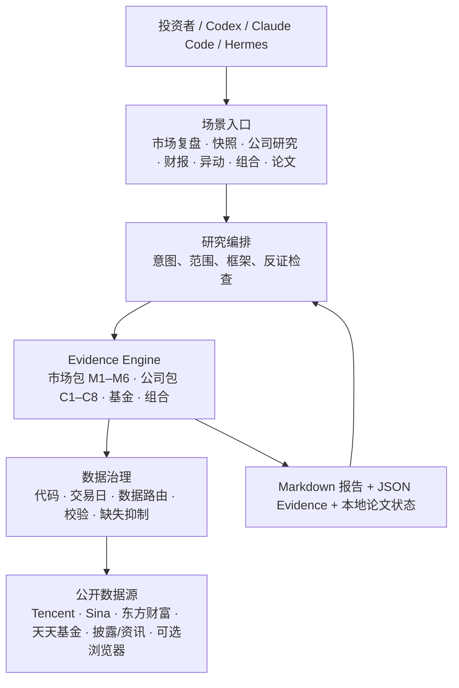
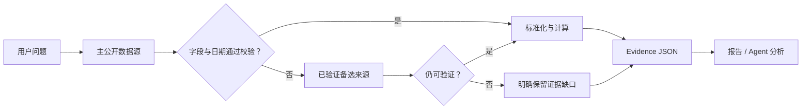
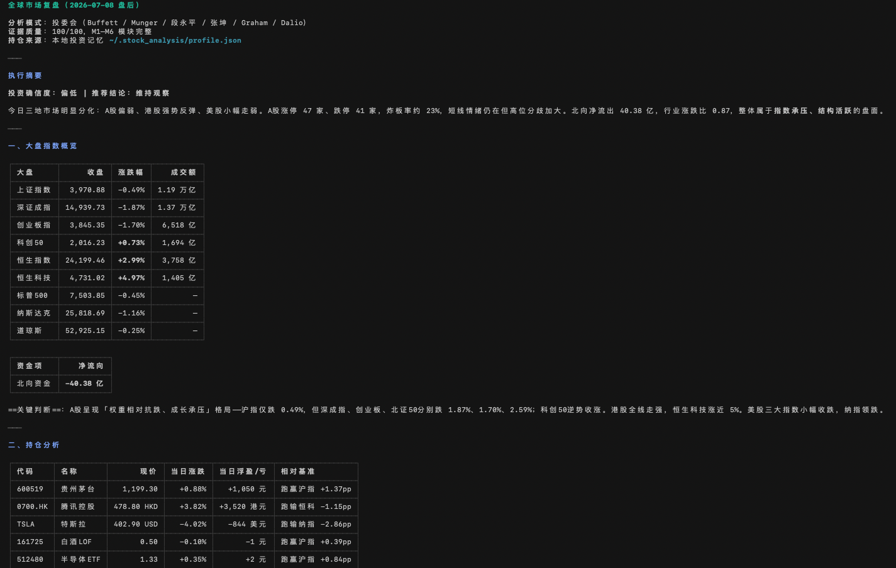
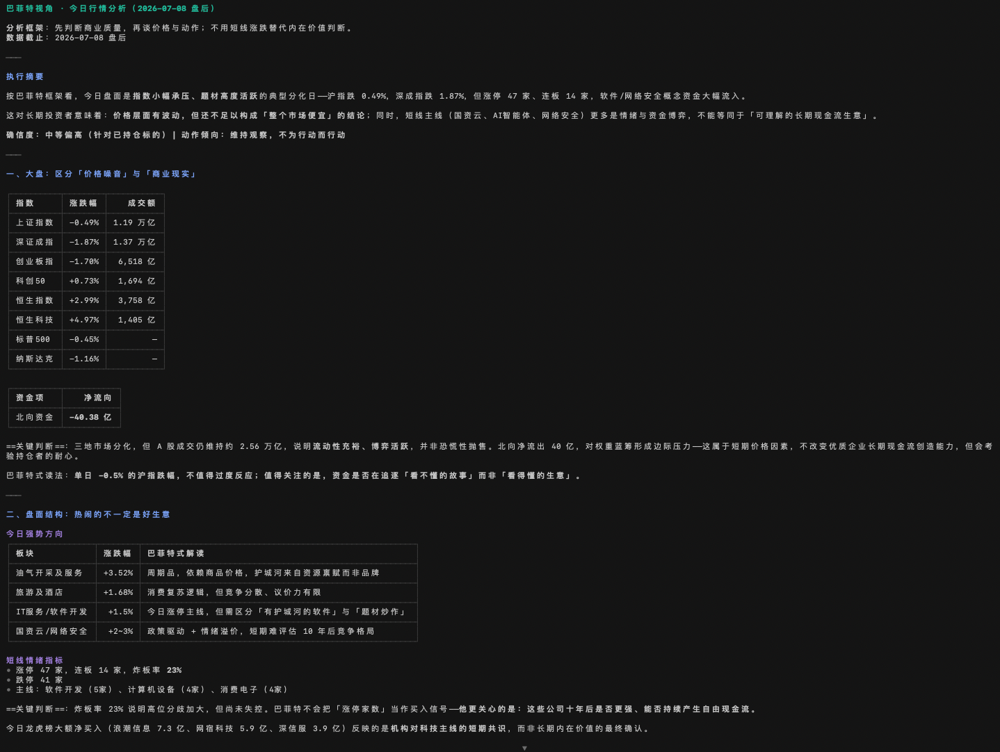
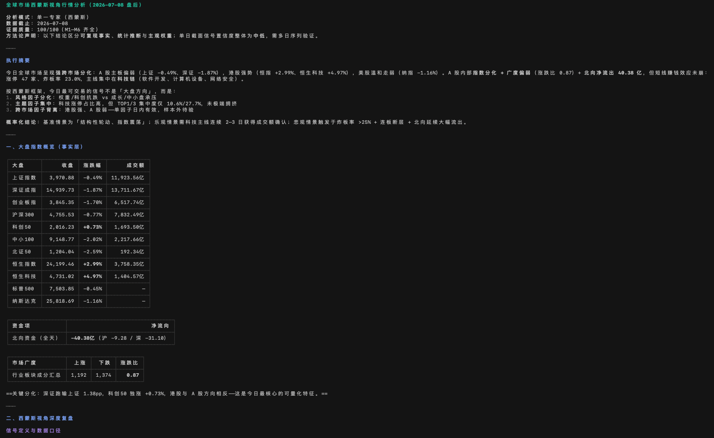
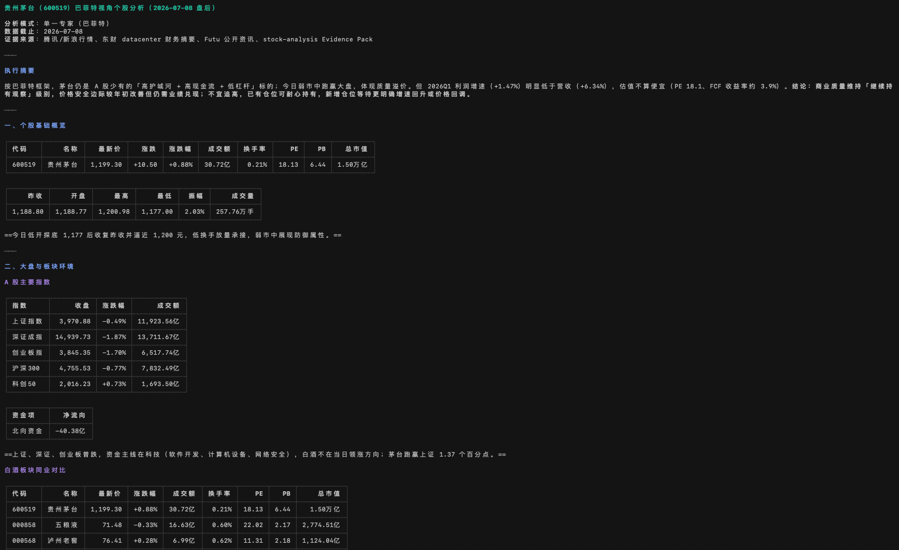
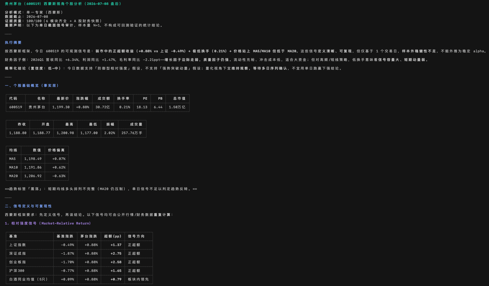
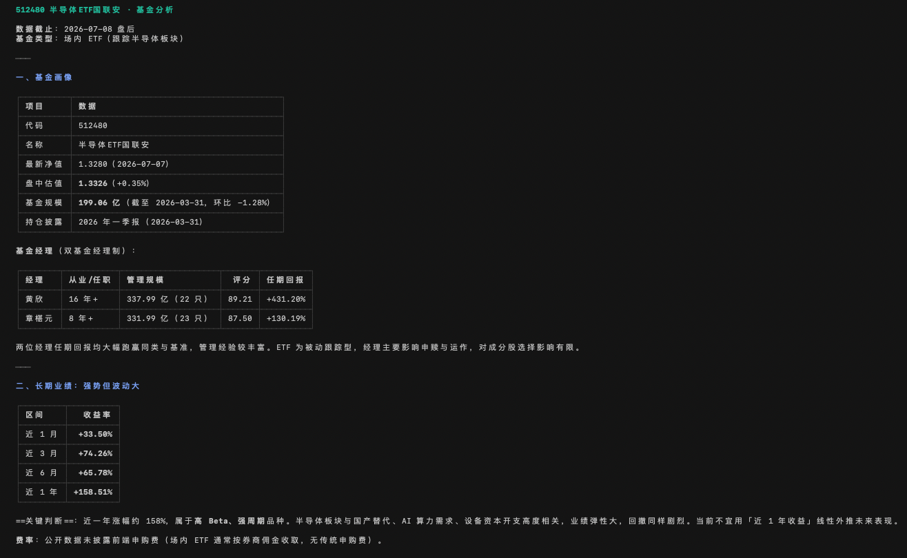

# stock-analysis

<div align="center">
  <a href="./README.md">English</a> |
  <a href="./README.zh-CN.md">简体中文</a>
</div>

<p align="center">
  
</p>

<p align="center">
  <strong>面向 AI Agent、量化研究者和投资者的证据优先市场复盘 CLI。</strong>
</p>

<p align="center">
  A 股 / 港股 / 美股 · 基金 · 持仓 · JSON Evidence Pack · 数据质量评分 · 多源降级 · 投资者 lens
</p>

<p align="center">
  <a href="https://github.com/thuquant/awesome-quant"></a>
  <a href="https://github.com/leoncuhk/awesome-quant-ai"></a>
  <a href="https://github.com/wangzhe3224/awesome-systematic-trading"></a>
</p>

<p align="center">
  已通过 PR <a href="https://github.com/thuquant/awesome-quant/pull/48">#48</a> 收录到
  <a href="https://github.com/thuquant/awesome-quant">thuquant/awesome-quant</a>。
</p>

<p align="center">
  已通过 PR <a href="https://github.com/leoncuhk/awesome-quant-ai/pull/39">#39</a> 收录到
  <a href="https://github.com/leoncuhk/awesome-quant-ai">leoncuhk/awesome-quant-ai</a> 的
  <em>Tools and Platforms / Data Providers</em>。
</p>

<p align="center">
  已通过 PR <a href="https://github.com/wangzhe3224/awesome-systematic-trading/pull/124">#124</a> 收录到
  <a href="https://github.com/wangzhe3224/awesome-systematic-trading">wangzhe3224/awesome-systematic-trading</a>。
</p>

`stock-analysis` 把公开市场数据整理成可复查的 Markdown 报告和机器可读的证据文件。它适合做稳定、可重复的行情复盘，而不是输出黑箱交易信号。

```bash
uv tool install stock-analysis

stock-analysis --market daily
stock-analysis --market stock --symbol 600519
stock-analysis --market screen --fiscal-year 2025 --universe-file official_universe.json --filter roe_weighted:gt:8% --sort roe_weighted:desc
stock-analysis --market global --format full --with-holdings --emit-evidence
```

> 输出仅供研究参考，不构成投资建议。

## 72 秒演示

- [简体中文视频](promo/demo-video/out/stock-analysis-demo-zh-CN.mp4)
- [English video](promo/demo-video/out/stock-analysis-demo-en.mp4)

两个演示均为 1080p，以字幕传递完整信息，静音也能观看；可编辑的 Remotion 工程位于 [`promo/demo-video`](promo/demo-video/)。

## 为什么需要它

很多“AI 行情分析”是先写 prompt，再得到一段看起来流畅的文字。`stock-analysis` 的顺序相反：先有证据，再写结论。

- 抓取 A 股、港股、美股、基金和持仓相关的公开市场数据。
- 在下结论前统一处理代码、时间戳、来源元数据和缺失字段。
- 用六个证据模块给报告质量打分，而不是假装每个数据源都正常工作。
- 输出 JSON，方便 AI Agent、notebook、cron 任务或人工审阅者检查和 diff。

如果数据源失败，报告会记录缺口。缺失指标保持缺失，不会用 `0` 回填，也不会用邻近信号硬猜。

## 从投资问题开始

先选择你遇到的投资问题，而不是拼凑底层参数。每个场景先生成确定性证据（可回查的价格、已披露财务或公开事件）；Agent 可以解释证据，但不能绕过来源、交易日和完整性校验。

| 你现在要解决的问题 | 什么时候用 | 场景入口 | 确定性 CLI |
|---|---|---|---|
| 今天市场发生了什么 | 开盘前、盘中或收盘后想先掌握市场背景 | `/market-recap` | `--market daily` |
| 核对一个标的的事实 | 只想看现价、近期涨跌、成交和已披露财务，不想要观点 | `/stock-snapshot` | `--market stock --symbol` |
| 这家公司是否值得继续花时间研究 | 准备建仓、继续持有或做一次更系统的事实核对 | `/stock-review` | `--market stock-review --symbol` |
| 财报出来后，哪些数字真的变了 | 已发布季报/年报后，只复核公开披露的财务事实 | `/earnings-review` | `--market earnings --symbol` |
| 一只股票突然涨跌，先发生了什么 | 想区分价格、成交和公开事件，避免把新闻直接当原因 | `/price-move` | `--market price-move --symbol` |
| 我的持仓是否过于集中 | 已保存完整持仓资料后检查集中度、市场和币种暴露 | `/portfolio-review` | `--market portfolio` |
| 找出满足明确财务条件的 A 股 | 已有 ROE、营收增速等硬条件，且希望结果可重复 | `/stock-screen` | `--market screen …` |
| 留下并复查自己的投资理由 | 已经形成投资假设，想在以后用新事实重新核对 | `/thesis-create`、`/thesis-review` | `--market thesis-create|thesis-review --symbol` |

Claude Code 原生支持 `/command` 入口。Codex 的 Custom Prompt 显示为 `/prompts:stock-review`；安装生成的 Skill 后，Agent 可以根据 Skill 描述把“分析腾讯”这类自然语言请求匹配到相应 Skill，并执行其中的确定性命令。意图识别发生在宿主 Agent，而非 `stock-analysis` Python 包内部。所有入口均从同一份 canonical catalog 生成，避免工作流漂移。

## 系统如何工作



核心边界是：**场景选择研究问题，代码获取并校验证据，lens 只能解释已存在的证据。** M1–M6 服务于市场与组合状态；独立的 C1–C8 Company Evidence Pack 用于“这家公司本身怎么样”，避免把市场热度或单日涨跌误当成公司事实。



## Agent 安装

在仓库根目录生成并校验已跟踪入口：

```bash
python3 scripts/sync_agent_entrypoints.py --check
scripts/install-agent-entrypoints.sh codex
scripts/install-agent-entrypoints.sh claude
```

安装器只复制 Codex Skills 到 `${CODEX_HOME:-~/.codex}/skills`、Claude commands 到 `${CLAUDE_CONFIG_DIR:-~/.claude}/commands`；不会安装新的行情依赖，也不会修改持仓记忆。

## 报告示例

| 投委会复盘 | Buffett 视角复盘 | Simons 视角复盘 |
|---|---|---|
| [2026-07-09 投委会行情复盘](reports/20260709-投委会-行情复盘.md)<br> | [2026-07-09 巴菲特行情复盘](reports/20260709-巴菲特-行情复盘.md)<br> | [2026-07-09 西蒙斯行情复盘](reports/20260709-西蒙斯-行情复盘.md)<br> |

| Buffett 个股 lens | Simons 个股 lens | 基金画像 |
|---|---|---|
| [贵州茅台 600519](reports/20260709-巴菲特-贵州茅台600519.md)<br> | [贵州茅台 600519](reports/20260709-西蒙斯-贵州茅台600519.md)<br> | [512480 半导体ETF](reports/20260709-512480-半导体ETF基金分析.md)<br> |

更多报告、截图、社交分享素材和自动化示例见 [reports/](reports/)。

## 你会得到什么

| 能力 | 含义 |
|---|---|
| Evidence Pack JSON | 生成 `evidence_YYYYMMDD.json` 和 M1-M6 模块文件，便于审计、自动化和 Agent 交接。 |
| A 股 / 港股 / 美股 / 基金覆盖 | 一个 CLI 同时覆盖全市场快照、单股、基金和持仓暴露。 |
| 数据源路由 | 稳定场景优先 Tencent / Sina，中国市场特有数据走 Eastmoney，只有必要时才用浏览器降级。 |
| 质量评分 | 报告带 100 分证据质量评分，并明确标出缺失模块。 |
| 投资者 lens | 内置 Buffett、Munger、Graham、Simons、Dalio、Duan Yongping、Zhang Kun 等结构化 lens。 |
| 本地持仓记忆 | 可选的本地持仓 profile，支持基准对比、集中度风险和汇率归一。 |
| A 股确定性选股 | 严格年报条件、官方 Universe 门禁、逐股 PASS/FAIL/UNKNOWN 与可审计 Evidence JSON。 |
| 受校验的市场证据 | 北向资金需通过完整日内序列校验；基金画像按每只基金逐字段覆盖；A 股/场内基金在日 K 样本完整时提供 5d/20d/60d 量价与拆分归一后的折溢价序列。 |

## 快速开始

从 PyPI 安装：

```bash
uv tool install stock-analysis
stock-analysis --market daily
```

从本地仓库运行：

```bash
git clone https://github.com/AdvancingTitans/stock-analysis.git
cd stock-analysis
uv run stock-analysis --market daily
```

常用命令：

```bash
# 按北京时间市场阶段自动选择 summary/key-points/full
stock-analysis --market daily

# 带 JSON 证据的完整全球市场复盘
stock-analysis --market global --format full --emit-evidence

# 确定性的单股快照，不依赖 LLM
stock-analysis --market stock --symbol 600519

# 想系统核对一家公司时使用：输出公司事实和明确缺口，不给综合买入分
stock-analysis --market stock-review --symbol 600519 --emit-evidence

# 财报发布后使用：仅复核已披露的结构化财务事实
stock-analysis --market earnings --symbol 600519 --emit-evidence

# 股价突然涨跌时使用：列出量价和公开事件，但不把相关性断言为因果
stock-analysis --market price-move --symbol 600519 --emit-evidence

# 建立并复查本地结构化投资论文快照
stock-analysis --market thesis-create --symbol 600519
stock-analysis --market thesis-review --symbol 600519

# 带公开画像和持仓数据的基金快照
stock-analysis --market fund --symbol 161725

# 确定性 A 股年报选股；必须提供完整的官方 Security Master 快照
stock-analysis --market screen --fiscal-year 2025 --universe-file official_universe.json \
  --filter roe_weighted:gt:8% --filter revenue_growth_yoy:gt:8% \
  --sort roe_weighted:desc --limit 20 --emit-evidence

# 诊断 Tencent、Sina、Eastmoney、browser 和可选 mootdx 路由
stock-analysis --market diagnose
```

## 证据模块

### Company Evidence Pack（C1–C8）

把它理解为一份“继续研究前的事实清单”，不是选股器，也不是自动给出买卖答案。

**什么时候触发？** 当你准备回答“我是否要继续研究/持有这家公司？”时，运行 `/stock-review` 或 `stock-analysis --market stock-review --symbol <代码>`。它不会因你输入一个代码就自动创建持仓、保存投资理由或给出综合评分；只有你明确运行 `thesis-create` 时，才会在本地保存一份论文快照。

**它会给你什么？** 报告逐项列出已经核验到的事实、还没有公开或尚未接入的数据，以及下一步该补什么。例如：财务质量和估值数据可用时会列出对应期间和来源；护城河、管理层与资本配置没有足够可观察资料时，会直接写“证据暂缺”，而不是用“优质公司”之类的主观判断代替。

| 模块 | 用投资者语言回答的问题 | 当前会优先核对的内容 |
|---|---|---|
| C1 商业质量 | 它靠什么赚钱？ | 报价、市场和可获得的业务事实；业务拆分不足会保留缺口。 |
| C2 财务质量 | 赚的钱和现金流是否有公开证据支持？ | 已披露营收、利润率、ROE、负债、经营现金流、自由现金流等。 |
| C3 增长质量 | 增长是否能从已披露数字中看出来？ | 收入和利润等结构化历史数据；无法拆解的增长来源不猜测。 |
| C4 护城河证据 | 定价权、客户黏性或成本优势有数据支持吗？ | 只采用可观察证据；没有资料就明确缺失。 |
| C5 管理层与资本配置 | 回购、分红、并购、稀释或治理事件是否可核对？ | 已接入的公开事件；未覆盖时不作管理层评价。 |
| C6 估值与安全边际 | 当前价格、估值相关事实和条件是什么？ | 报价、已披露财务事实和可计算指标；不输出“买入评分”。 |
| C7 风险与反证 | 哪些事实会削弱原先的判断？ | 量价异常、已披露风险及证据缺口。 |
| C8 催化剂与论文跟踪 | 接下来有什么公开事件值得复查？ | 新闻/事件样本与本地论文快照的复查入口。 |

**最简单的用法：** 先运行一次 `stock-review`，阅读“可用模块”和“缺失模块”；若你只是想确认今天价格和近期表现，用 `stock-snapshot` 即可；若财报刚发布，优先用 `earnings-review`；若价格突变，优先用 `price-move`。这是四个不同的问题，不能互相替代。

公司研究和每日市场复盘使用不同的数据边界。`company_evidence_<symbol>_<date>.json` 保存 C1–C8 的可验证事实和缺口；当前结构化财务适配器以 A 股为主。港美股的原始披露字段在接入可验证适配器前会明确保留为缺口，因此它们不应被当作完整的基本面研究结论。

每个财务事实都会记录期间、币种、会计范围、来源类型、来源和置信度，方便你回查数字来自哪里。[`config/metric_registry.json`](config/metric_registry.json) 规定指标如何校验、可被哪些框架使用；它不会输出综合“买入评分”。

启用 `--emit-evidence` 后，CLI 会写出：

```text
evidence_YYYYMMDD.json
m1_YYYYMMDD.json
m2_YYYYMMDD.json
m3_YYYYMMDD.json
m4_YYYYMMDD.json
m5_YYYYMMDD.json
m6_YYYYMMDD.json
```

六模块评分关注的是报告可信度，不是收益宣传：

| 模块 | 关注点 | 权重 |
|---|---:|---:|
| M1 | 跨市场指数状态、广度、流动性、基准背景 | 20 |
| M2 | 行业和概念轮动 | 20 |
| M3 | 短线情绪和涨停结构 | 20 |
| M4 | 风险、突破失败、下行压力 | 15 |
| M5 | 持仓暴露、风格、集中度、持仓脉冲 | 15 |
| M6 | 韧性方向和下一交易日观察清单 | 10 |

即使质量评分偏低，完整报告也会保持相同结构；缺失模块会在相关章节自然说明。

当前交易日的 A 股全市场广度，优先要求东财 `clist` 的每一页、服务端总数和有效行数全部对账；若连接失败，Sina `hs_a` 必须分页至空页/短页，并核对唯一代码和有效行数。历史日期保留“不可用”，不会把行业板块成分汇总冒充全市场。Tencent 日 K 线样本齐全时，Evidence 还会提供 5d/20d/60d 收益、成交量 z-score 与 ATR。

## 为 Agent 而设计

`stock-analysis` 对工具调用友好：

- 先有确定性 CLI，LLM 层可以后续消费 evidence。
- Markdown 给人看，JSON 给机器工作流用。
- 明确记录来源事件和 fallback 原因。
- 命令界面稳定，适合 cron、notebook、Hermes、Codex、Claude Code 和其他工具调用型 Agent。

示例 Agent prompt：

```text
Run stock-analysis --market global --format full --emit-evidence.
Use the Markdown report for the user-facing recap.
Use evidence_YYYYMMDD.json to verify every strong conclusion before summarizing.
If a module is missing, say which evidence was unavailable instead of guessing.
```

日常 Agent 工作流见 [examples/agent.md](examples/agent.md)，定时生成报告并上传 Evidence Pack 的 GitHub Actions 示例见 [examples/github-actions-daily-recap.yml](examples/github-actions-daily-recap.yml)。

## 它不是什么

- 不是交易机器人。
- 不是券商接口。
- 不承诺覆盖所有市场数据。
- 不能替代专业投资建议。
- 不是黑箱 LLM 报告生成器。

## 数据源策略

| 场景 | 主路径 | 降级路径 |
|---|---|---|
| A 股行情和估值 | Tencent → Sina | Eastmoney `stock/get` |
| A 股指数 | Tencent → Sina | Eastmoney index endpoints |
| 板块排行 | Eastmoney `clist` | Tonghuashun public pages → browser fallback |
| 港股行情 | Tencent/Sina | Eastmoney `stock/get` |
| 美股行情 | Sina/Tencent | Eastmoney `searchapi` → `stock/get` |
| 基金 | Eastmoney/Tiantian fund pages | Sina fund fallback |
| 深度 tick / order-book 数据 | Optional `mootdx` | Basic Tencent/Sina quotes |

Yahoo 不是推荐默认路径的一部分，这是有意为之。

## 投资者 Lens

Lens engine 可以把同一份 evidence 按不同投资框架组织成报告。当前支持：

`buffett`, `munger`, `graham`, `klarman`, `lynch`, `o_neil`, `wood`, `dalio`, `soros`, `livermore`, `minervini`, `simons`, `duan_yongping`, `zhang_kun`, `feng_liu`.

Lens 会改变证据优先级和叙事结构，但不会绕过数据质量规则，也不会编造缺失数字。

### 内置 lens 与 committee 边界

当前 CLI 版本为 `4.5.0`。

LensEngine 是报告生成的核心编排器。默认使用 committee 模式；该模式会综合 M1-M6 证据做跨模块深度分析，也就是原来的 m1/m6 综合深度分析边界。自然语言调用可以表达为“用巴菲特模式分析贵州茅台”或“用 adversarial 模式让巴菲特和芒格辩论腾讯”。如果 `committee` 失败，会降级为 `single`，也就是 committee 失败时降级为 single，并在 metadata 中保留 fallback 原因。

`committee` 报告有固定骨架：执行摘要 → 大盘指数概览 → 持仓分析（有完整持仓时）→ 六模块深度复盘 → 综合持仓建议与风险提示。结尾建议需要覆盖现状总结、基准跑赢/跑输、条件化仓位动作、下一交易日观察清单和风险提示。证据附录不进入早盘、盘中、午间或盘后正文；如果 M1-M6 某个模块缺失，相关章节必须说明证据暂缺。

`--market stock --symbol <code>` 和 `--market fund --symbol <code>` 是确定性证据视图，不要求用户安装任何外部行情 CLI。浏览器路径只作为 API 连续失败或页面独有数据的降级路径；工程细节进入 evidence/diagnose，不进入正文。

北向资金只有在当前交易日的序列覆盖至 14:50 后、分钟样本充足且开盘基线合理时才展示绝对值；历史或半截序列保持不可用。基金画像按每只基金、每个字段核验，因此 ETF 未返回费率时不会被当作可比费率。板块榜同时记录来源 taxonomy，未经归一不能把不同提供方的分类直接横向比较。

场内基金折溢价使用腾讯前复权日 K 线和天天基金官方历史净值分页逐日对齐；公开份额拆分会先归一，无法解析的公司行为则不生成序列。基金页面的年化跟踪误差只作为披露元数据展示，不冒充本工具按日重算的 tracking error。

基金画像通过天天基金公开评估页 `pingzhongdata` 补充长期业绩、前端费率、规模和基金经理画像；该路径不依赖登录或 API key。基金速览应展示长期业绩、前端费率、基金经理信息和已披露缺口。

投资记忆默认路径为 `~/.stock_analysis/profile.json`，也可以用 `STOCK_ANALYSIS_PROFILE` 覆盖。完整持仓必须同时具备股票代码、买入日期、买入数量或买入金额。若用户新提供的信息与之前保存的投资记忆不一致，确认信息完整性后，优先以用户新提供的信息为准，并覆盖写入投资记忆。

当用户明确提出想用哪位投资专家的风格时，整篇报告都必须完全以相关专家的视角输出报告，不得只在结尾追加专家点评。单专家视角和多专家综合的结构不同，但都不得模仿身份声明或虚构专家发言。

## 贡献

适合上手的贡献方向：

- 新增或加固公开数据源 adapter。
- 改进报告模板或投资者 lens。
- 为新的地区、标的类型或 Agent 工作流补充示例。
- 带着 `--market diagnose` 输出报告数据源失效。
- 把项目提交到匹配度高的 Awesome List 或 Agent 工具目录。

请先阅读 [CONTRIBUTING.md](CONTRIBUTING.md) 和 [ROADMAP.md](ROADMAP.md)。

## Awesome List 简介

提交到精选列表时，可以使用这句简介：

> [stock-analysis](https://github.com/AdvancingTitans/stock-analysis) - Evidence-driven market recap CLI for AI agents and quant researchers, supporting A/HK/US stocks, funds, portfolios, auditable JSON Evidence Packs, data-quality scoring, investor lenses, and multi-source fallback routing.

适合目标包括 `awesome-quant-ai`、`awesome-ai-in-finance`、`awesome-quant` 和 `awesome-systematic-trading`。

## 开发

```bash
uv sync
uv run --with pytest pytest -q
uv run --with ruff ruff check
```

## License

MIT

以上内容仅供研究参考，不构成任何投资建议。股市有风险，投资需谨慎。
